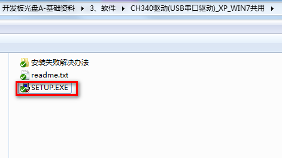
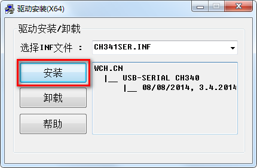
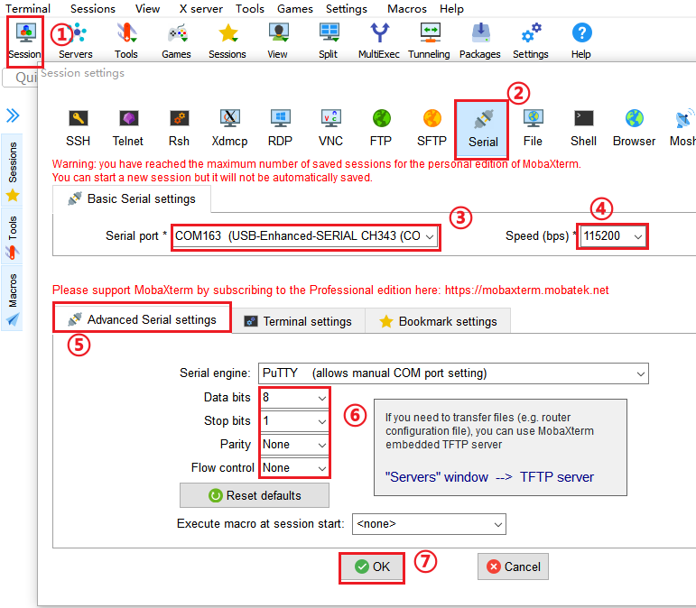
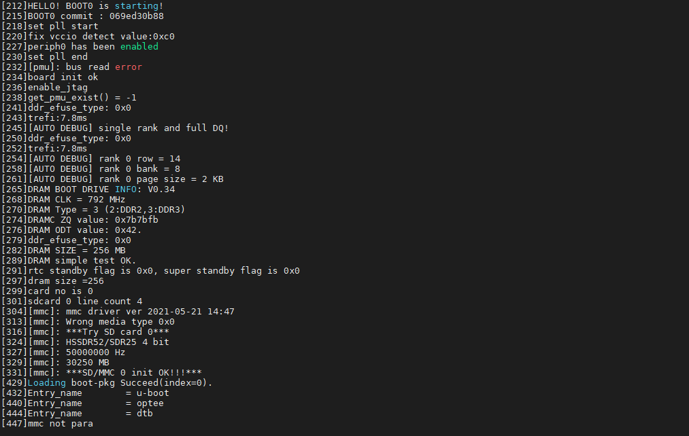
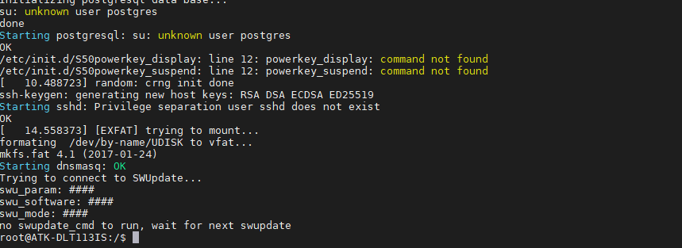

# 2.1 安装驱动和串口调试终端软件

## 2.1.1 安装CH340驱动

&emsp;&emsp;开发板的串口与电脑通信，需要安装CH340驱动，`T113-i开发板->开发板光盘A盘-基础资料->03、软件->CH340驱动(USB串口驱动)_XP_WIN7共用`找到SETUP.EXE双击进行安装。出现预安装成功或者安装成功则成功。

&emsp;&emsp;如果Win10安装失败，请下载驱动精灵，先使用发货时提供的USB Type-C数据线连接开发板底板的USB_TTL，USB接口端连接电脑，驱动精灵扫描硬件驱动，把相应的串口驱动装上就可以了。

 
图 2.1.1 双击SETUP.EXE安装

 
图 2.1.2 点击开始安装CH340驱动

## 2.1.2 如何使用串口调试终端软件

&emsp;&emsp;可以使用串口的终端软件有很多比如Xshell，SecureCRT，MobaXterm，甚至Ubuntu的终端都是可以连接开发板上的串口的。本文以MobaXterm安装为例，在众多终端软件来说算是对新手比较友好，因为界面比较好看，但是也有不足，不能自动重连串口。

&emsp;&emsp;`T113-i开发板->开发板光盘A盘-基础资料->03、软件->MobaXterm_Installer_v12.3.zip`双击解压进行安装即可，安装过程非常简单，默认下一步进行安装。这里不写安装过程了。

&emsp;&emsp;安装在桌面打开MobaXterm图标，软件界面如下图。

 
图 2.1.3 MobaXterm软件界面

&emsp;&emsp;发板接上USB Typec数据线到USB_TTL，连接电脑，开发板插上电源，出货时拨码开关已经拨好。MobaXterm按如下配置，点击Session（会话）->选择Serial（串口）类型->选择开发板设备对应的com口->选择波特率为115200（开发板默认波特率为115200）->高级设置->设置`流控为None`->点击确认。

 
图 2.1.4 MobaXterm 操作步骤

&emsp;&emsp;开发板上电，串口终端打印的信息如下。

 
图 2.1.5 启动打印信息

&emsp;&emsp;正常启动后，会看到终端又以下打印信息：

 
图 2.1.6 启动完成信息

