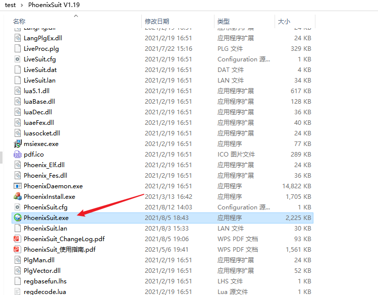
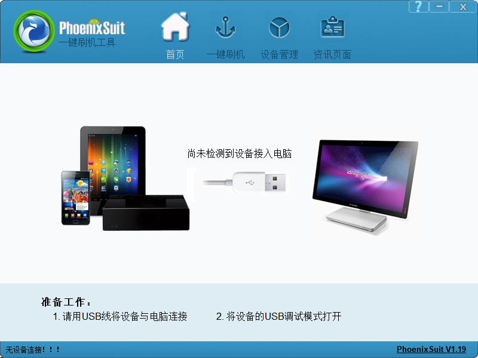
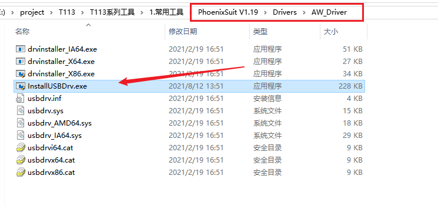
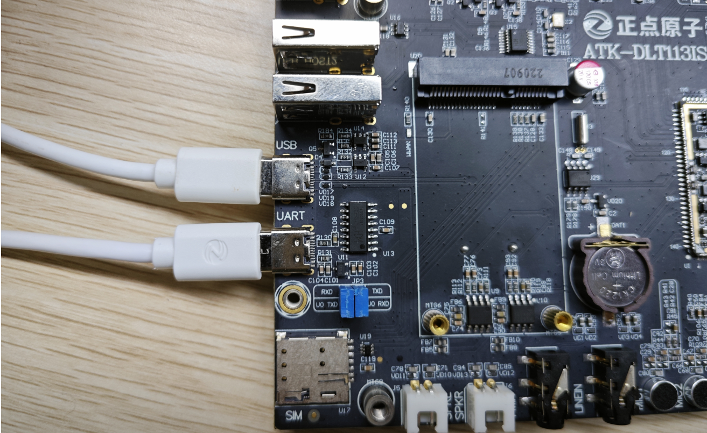
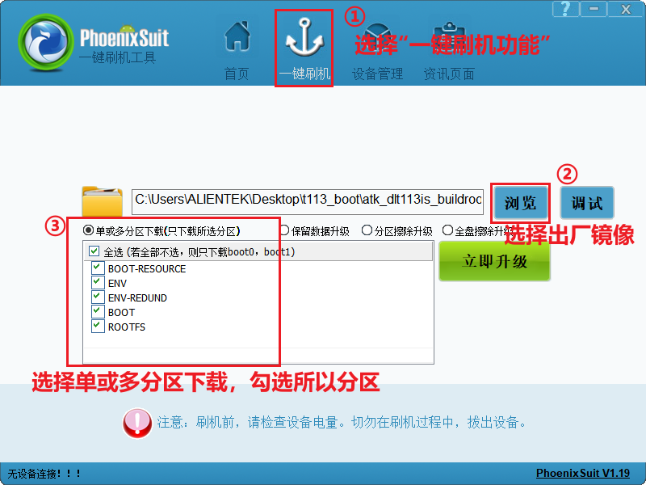
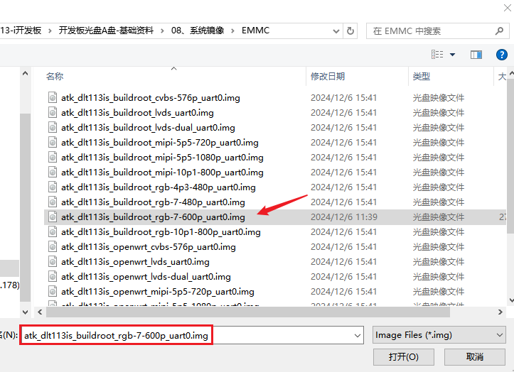
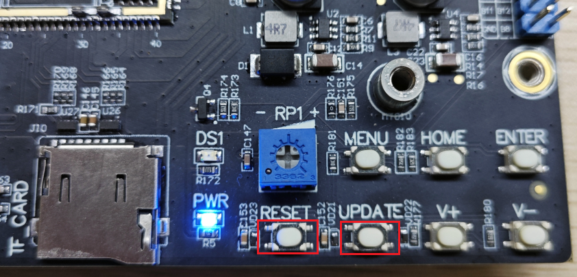
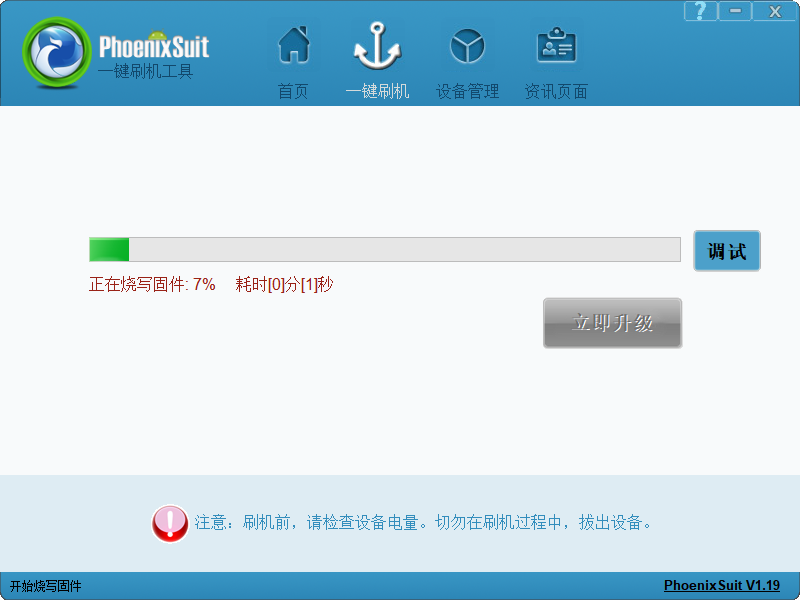
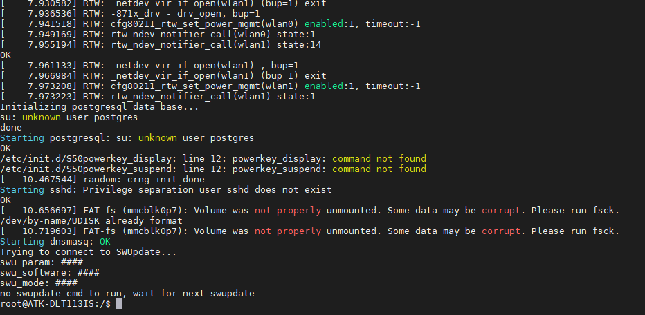
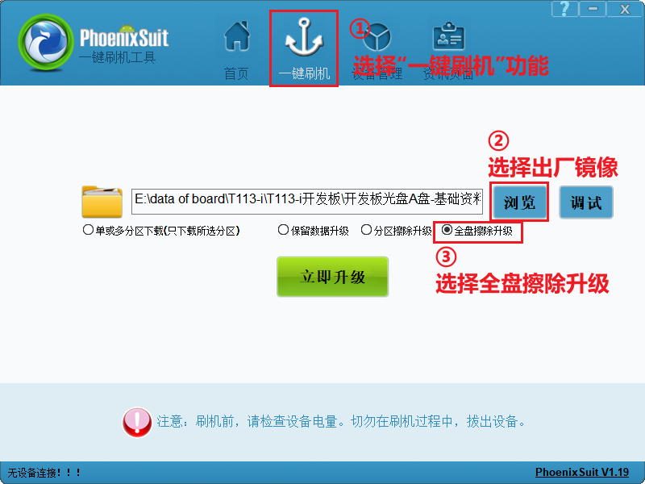

# 3.1 烧录系统到EMMC/NAND

## 3.1.1 PhoenixSuit软件的使用

&emsp;&emsp;全志提供了PhoenixSuit上位机烧录工具，此工具在Windows系统下运行，运行前要先安装。文件路径为：`开发板光盘A盘-基础资料->05、开发工具->03、T113-i系统烧录工具->PhoenixSuit V1.19.zip`，解压此文件。打开解压后的文件。双击打开PhoenixSuit.exe。这里作者演示烧录出厂系统的步骤，关于PhoenixSuit软件的更多功能可查阅PhoenixSuit软件同级目录下的PhoenixSuit_使用指南。

 
图 3.1.1 PhoenixSuit软件

&emsp;&emsp;PhoenixSuit软件示意图如下图所示：

 
图 3.1.2 PhoenixSuit界面

&emsp;&emsp;在进行连接开发板开发板烧录之前，需要先安装otg驱动，打开PhoenixSuit软件目录，进到PhoenixSuit V1.19\Drivers\AW_Driver目录下双击InstallUSBDrv.exe进行安装otg驱动即可。

 
图 3.1.3 InstallUSBDrv

&emsp;&emsp;在安装好驱动之后，开发板连接电脑时，PhoenixSuit软件才能识别到开发板。

## 3.1.2  连接开发板

&emsp;&emsp;在烧录之前需要将开发板USB_TTL、USB_OTG接口连接好，如下图所示：

 
图 3.1.4 开发板连接OTG接口

&emsp;&emsp;USB_TTL：串口打印终端，可在烧录时看串口信息，烧录时不接也可以，这里作者将它接上。

&emsp;&emsp;USB_OTG：烧录接口，接上后就可以进行系统烧录了。

## 3.1.3  一键刷机功能
&emsp;&emsp;在软件成功连接设备后，用户就可以进行烧录操作了。这里注意，**在开发板的OTG接口和电脑连接后，烧录工具并没有显示成功连接，这里对于软件首页提示的“无设备连接！！！”可以不用理会**。

&emsp;&emsp;点击“一键刷机”进入刷机界面，如下图所示：

 
图 3.1.5 PhoenixSuit操作步骤

&emsp;&emsp;点击“浏览”按钮，在弹出的窗口中选择后缀为“*.img”的固件文件。系统镜像在`开发板光盘A盘-基础资料\08、系统镜像\EMMC`路径下，如下图所示：（开发板有EMMC/NAND两种版本，以及支持多种屏幕接口RGB、LVDS、MIPI DSI，所以这里可以看到我们提供了多种镜像，方便烧录测试，这里我们演示烧录EMMC版本的镜像，如需烧录NAND版本则进到`开发板光盘A盘-基础资料\08、系统镜像\NAND`路径下选择对应的镜像即可。）

&emsp;&emsp;选择好固件之后选择单或多分区下载，全选所有分区。后续开发过程中如果只需要更新某个分区的内容可以单独勾选对应分区即可。

 
图 3.1.6 选择烧录镜像

&emsp;&emsp;在勾选好后，**不要按“立即升级”按钮**！接下来按住开发板的UPDATE按键不放，再按一下RESET按键，就可以进行烧录了。

 
图 3.1.7 开发板按键

&emsp;&emsp;烧录过程如下图所示：

 
图 3.1.8 PhoenixSuit烧录中

&emsp;&emsp;等待烧录完成即可。烧录成功后重启开发板，串口终端可以看到系统启动成功打印信息：

 
图 3.1.9 开发板启动完成打印信息

## 3.1.4  全盘擦除升级

&emsp;&emsp;这里介绍另一种烧录方式，全盘擦除升级，用这种方式可以跳过3.1.3小节步骤。

&emsp;&emsp;在软件成功连接设备后，用户就可以进行烧录操作了。这里注意，**在开发板的OTG接口和电脑连接后，烧录工具并没有显示成功连接，这里对于软件首页提示的“无设备连接！！！”可以不用理会**。

&emsp;&emsp;点击“一键刷机”进入刷机界面，如下图所示：

 
图 3.1.10 PhoenixSuit操作步骤

&emsp;&emsp;点击“浏览”按钮，在弹出的窗口中选择后缀为“*.img”的固件文件。系统镜像在`开发板光盘A盘-基础资料\08、系统镜像\EMMC`路径下，如下图所示：（开发板有EMMC/NAND两种版本，以及支持多种屏幕接口RGB、LVDS、MIPI DSI，所以这里可以看到我们提供了多种镜像，方便烧录测试，这里我们演示烧录EMMC版本的镜像，如需烧录NAND版本则进到`开发板光盘A盘-基础资料\08、系统镜像\NAND`路径下选择对应的镜像即可。）

&emsp;&emsp;选择好固件之后选择全盘擦除升级。

 
图 3.1.11 镜像选择

&emsp;&emsp;选好后，**不要按“立即升级”按钮**！接下来按住开发板的UPDATE按键不放，再按一下RESET按键，就可以进行烧录了。

 
图 3.1.12 开发板按键

&emsp;&emsp;烧录过程如下图所示：

 
图 3.1.13 PhoenixSuit烧录中

&emsp;&emsp;等待烧录完成即可。烧录成功后重启开发板，串口终端可以看到系统启动成功打印信息：

 
图 3.1.14 启动完成打印信息

