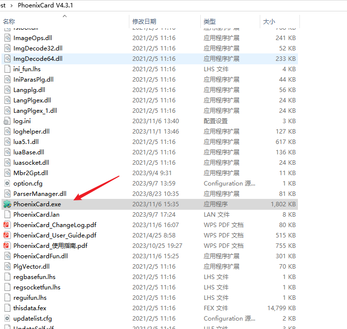
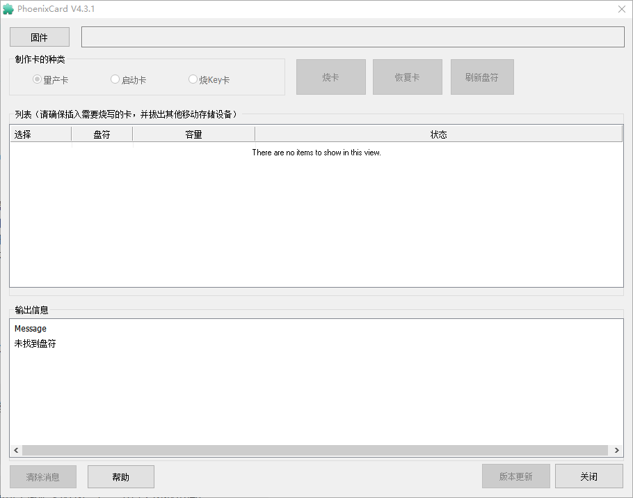
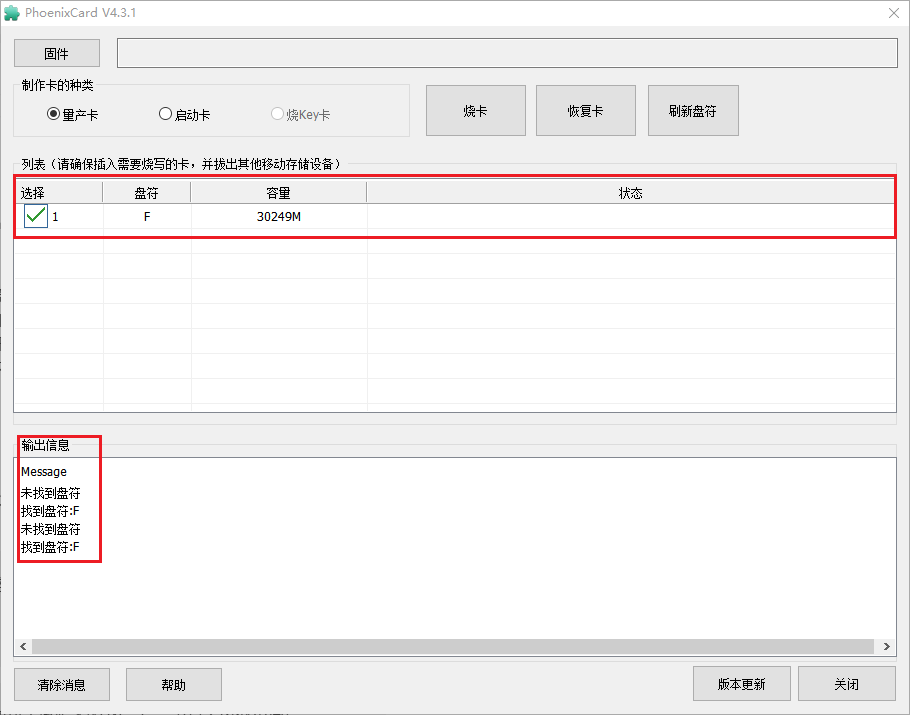
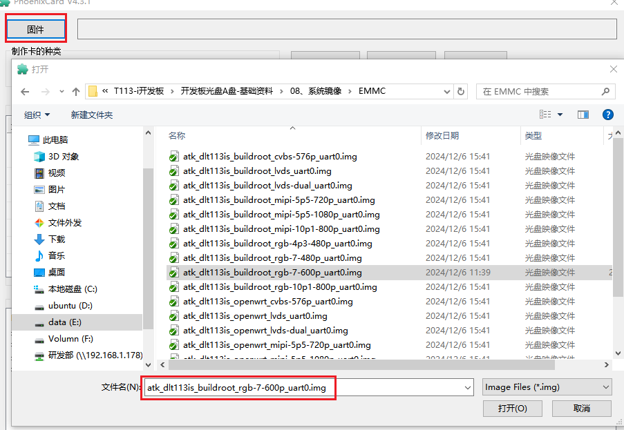
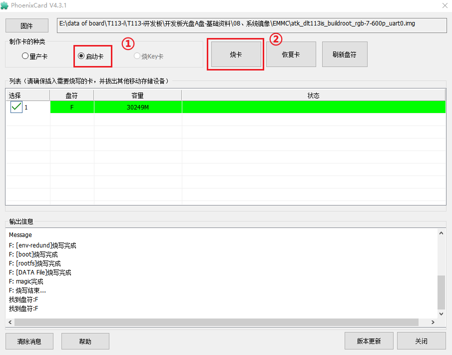
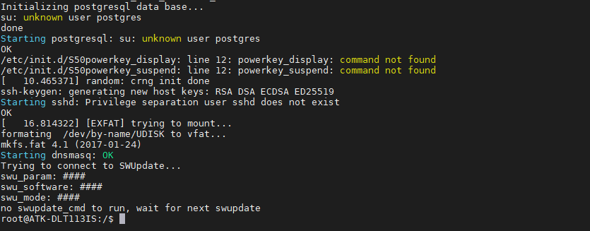

# 3.2  烧录系统到TF卡

## 3.2.1 PhoenixCard软件的使用

&emsp;&emsp;全志提供了PhoenixCard上位机烧录工具，此工具在Windows系统下运行，运行前要先安装。文件路径为：`开发板光盘A盘-基础资料\05、开发工具\T113-i系统烧录工具\PhoenixCard V4.3.1.zip`，解压此文件。打开解压后的文件。双击打开PhoenixCard.exe。这里作者演示烧录出厂系统的步骤，关于PhoenixCard软件的更多功能可查阅PhoenixCard软件同级目录下的PhoenixCard_使用指南。

 
图 3.2.1 PhoenixCard软件

&emsp;&emsp;PhoenixCard软件示意图如下图所示：

 
图 3.2.2 PhoenixCard界面

## 3.2.2 烧录系统到TF卡

&emsp;&emsp;首先将TF卡连接到电脑，等待软件识别到TF卡，软件连接到TF卡后界面如下所示：

 
图 3.2.3 PhoenixCard烧录过程

&emsp;&emsp;接下来单击界面左上角的“固件”按钮，选择后缀为“*.img”固件，这里作者选择“atk_dlt113is_buildroot_
rgb-7-600p_uart0.img”。出厂系统固件在`开发板光盘A盘-基础资料\08、系统镜像\EMMC`路径下，烧录至SD卡的固件可以用EMMC版本的固件。

 
图 3.2.4 镜像选择

&emsp;&emsp;选择好固件后，选择制作卡的种类为“启动卡”，单击“烧卡”，便可以进行烧录，烧录完成后界面如下所示：

 
图 3.2.5 PhoenixCard烧录完成

## 3.2.3 TF卡启动测试

&emsp;&emsp;将制作的TF卡插入开发板TF卡槽，上电启动，开发板将启动出厂系统。启动成功串口打印信息如下：

 
图 3.2.6 启动完成打印信息

