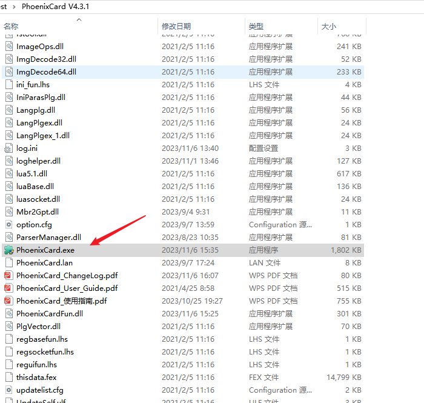
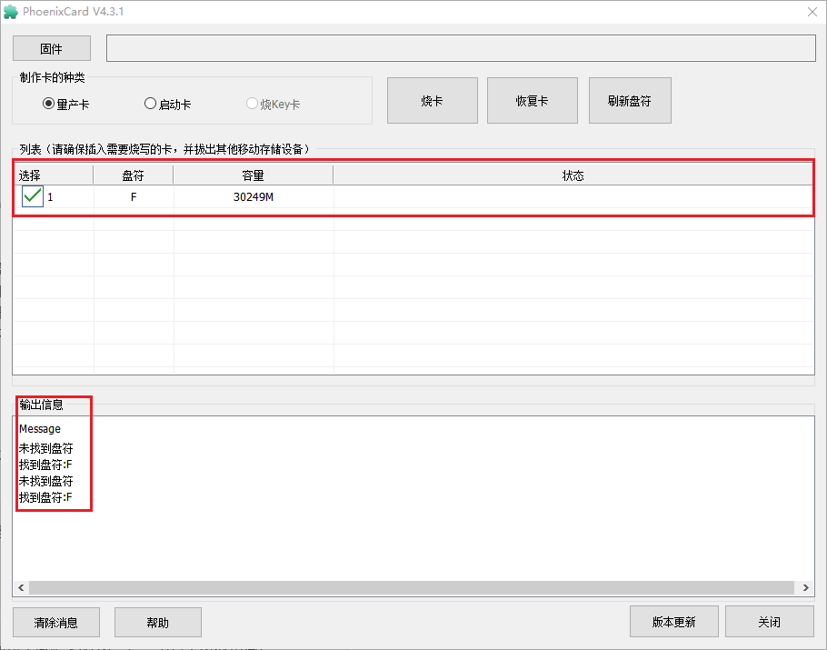
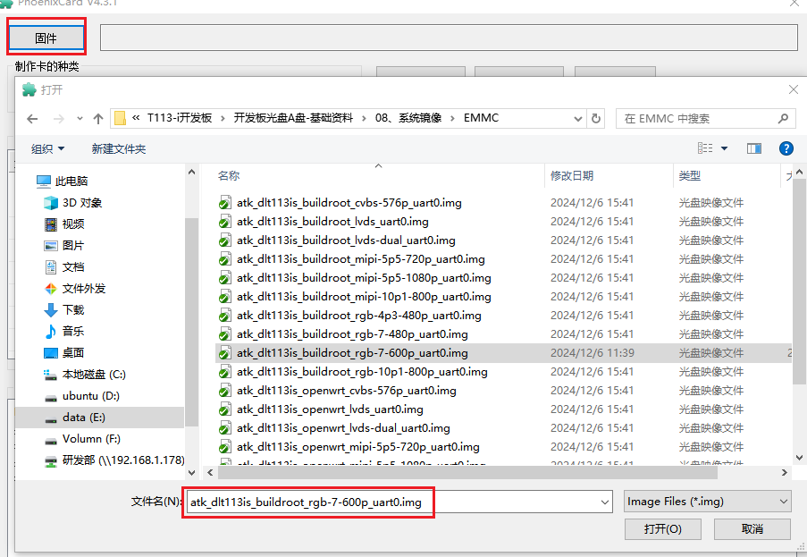
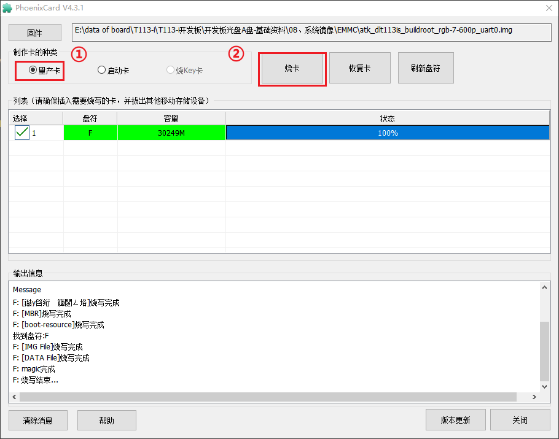
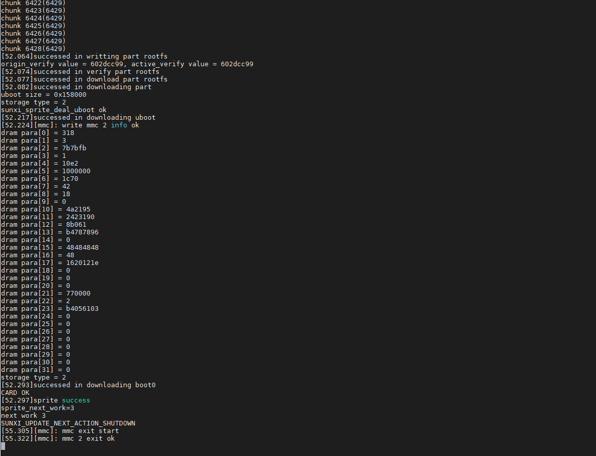

# 3.3  制作批量烧写卡

## 3.3.1 PhoenixCard软件的使用

&emsp;&emsp;全志提供了PhoenixCard上位机烧录工具，此工具在Windows系统下运行，运行前要先安装。文件路径为：`开发板光盘A盘-基础资料->05、开发工具->03、T113-i系统烧录工具->PhoenixCard V4.3.1.zip`，解压此文件。打开解压后的文件。双击打开PhoenixCard.exe。这里作者演示制作批量烧写卡的步骤，关于PhoenixCard软件的更多功能可查阅PhoenixCard软件同级目录下的PhoenixCard_使用指南。

 
图 3.3.1 PhoenixCard软件

## 3.3.2  制作烧写卡 

&emsp;&emsp;首先将TF卡连接到电脑，等待软件识别到TF卡，软件连接到TF卡后界面如下所示：

 
图 3.3.2 PhoenixCard界面

&emsp;&emsp;接下来单击界面左上角的“固件”按钮，选择后缀为“*.img”固件，这里作者选择“atk_dlt113is_buildroot_
rgb-7-600p_uart0.img”。出厂系统固件在`开发板光盘A盘-基础资料\08、系统镜像\EMMC`路径下，烧录至SD卡的固件可以用EMMC版本的固件。

 
图 3.3.3 镜像选择

&emsp;&emsp;选择好固件后，选择制作卡的种类为“量产卡”，单击“烧卡”，便可以进行烧录，烧录完成后界面如下所示：

 
图 3.3.4 制卡步骤

## 3.3.3  利用烧写卡更新开发板系统

&emsp;&emsp;制作完烧写卡后，将烧写卡插入开发板TF卡槽，上电启动，待串口终端有如下打印信息说明系统烧录完成。此时拔出烧写卡，重新启动开发板便可进到烧录后的系统。

 
图 3.3.5 烧录过程

