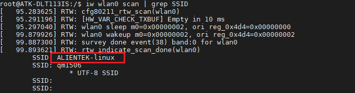
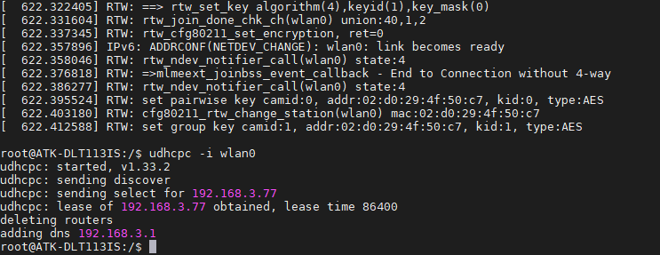
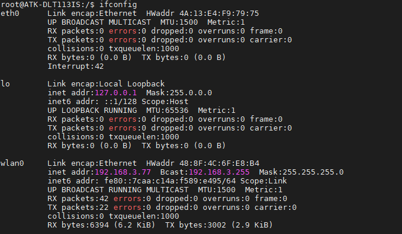
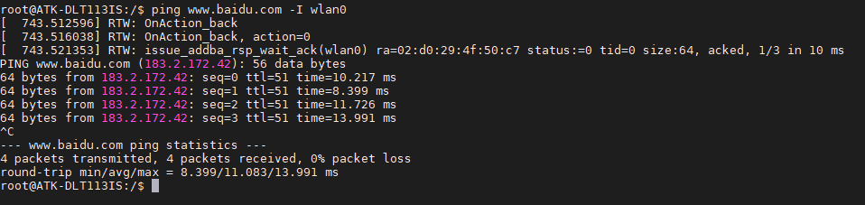
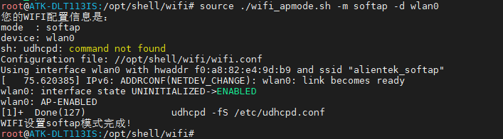
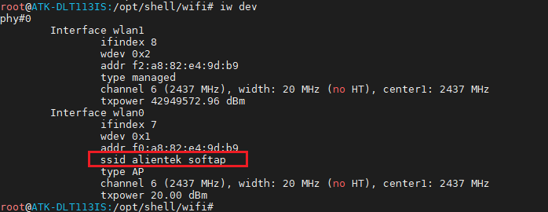
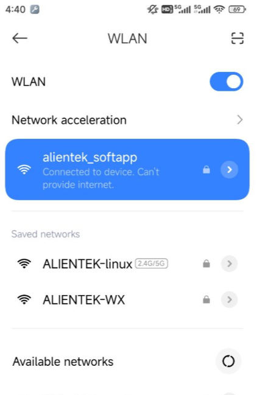

# 4.10 板载wifi测试

## 4.10.1 上网（Station）模式

&emsp;&emsp;扫描 WIFI 热点，使用文件系统提供的 iw 指令可扫描出热点名称。如果要查看完整的热点信息， 先开启 wlan0， 使用 iw wlan0 scan 指令，这里使用 grep 过滤掉了一些信息。 

```c#
ifconfig wlan0 up
iw wlan0 scan | grep SSID 
```

&emsp;&emsp;如下图扫描出热点名称“ALIENTEK-linux”，其中“x00\x00\...”是因为带中文字符显示不出来。所以用户的热点最好是由英文字符组成。 

<center>
<br />
图 4.10.1 扫描热点
</center>

&emsp;&emsp;编辑要连接的热点信息，将/etc/wpa_supplicant.conf 修改成如下,输入:wq 保存退出。请修改个人热点的 ssid，及 psk。 

&emsp;&emsp;解释：<br />
&emsp;&emsp;- ssid 为无线网络名称<br />
&emsp;&emsp;- psk 为无线网络密码

```c#
vi /etc/wpa_supplicant.conf  
```

&emsp;&emsp;输入以下内容。 

```c#
ctrl_interface=/var/run/wpa_supplicant
ap_scan=1

	network={
		ssid="ALIENTEK-linux"
		psk="1590202****"
	} 
```

&emsp;&emsp;如果热点是无密码的则需要将/etc/wpa_supplicant.conf，改成如下 

```c#
ctrl_interface=/var/run/wpa_supplicant
ap_scan=1

	network={
		ssid="ALIENTEK-linux"
		key_mgmt=NONE 
	} 
```

&emsp;&emsp;执行下面的指令连接热点及获取 ip。 

```c#
wpa_supplicant -Dnl80211 -c /etc/wpa_supplicant.conf -i wlan0 & 
udhcpc -i wlan0 
```

<center>
<br />
图 4.10.2 连接到 WIFI 热点
</center>

&emsp;&emsp;看到如上结果，已经连接到 WIFI 热点，及获取到 ip 信息。也可以用 ifconfig 指令查看我们的 wlan0 所获取的 ip 地址。

<center>
<br />
图 4.10.3 获取到的ip
</center>

&emsp;&emsp;ping 百度测试连通性，也可以 ping 网关来测试 WIFI 的连通性。 备注：如果 ping 不通百度，请重启开发板，不要插网线，重新连接 WIFI 即可！ 因为系统会默认只让一个网络设备连通外
网。

```c#
ping www.baidu.com -I wlan0
ping 192.168.3.1 -I wlan0 
```

<center>
<br />
图 4.10.4 ping百度测试
</center>

## 4.10.2 热点（SoftAP）模式

&emsp;&emsp;我们可以把板子上的 WIFI 开启热点，让其他手机（或者其他板子） 连接到这个热点上。这样可以将手机（或其他板子）与开发板连接，构成一个局域网，可以通过 TCP、 UDP 等与 ATK-DLT113IS 板子进行通信。 如果不了解什么是 TCP 和 UDP 通信，建议自行找资料看看。 

&emsp;&emsp;直接在我们上一步的目录/opt/shell/wifi 执行如下指令

```c#
source ./wifi_apmode.sh -m softap -d wlan0
```

<center>
<br />
图 4.10.5 脚本配置
</center>

&emsp;&emsp;输入下列指令可以查看配置的网卡信息

```c#
iw dev 
```

<center>
<br />
图 4.10.6 查看配置的网卡信息
</center>

&emsp;&emsp;如上，可以看到开启的热点名称为“alientek_softap”， 默认密码为 12345678。 要修改热点名称和密码，请自行打开 wifi_apmode.sh 脚本修改即可。

&emsp;&emsp;手机输入密码连接后， 即可连接，开发板将自动为手机分配 IP（请更新到 v1.2 版本以上文件系统，体验）。 **连接成功后，有的手机会判断这个网络是无法访问互联网的状态，会询问您是否要保持这个网络连接，我们点击保持连接即可！**

&emsp;&emsp;连接成功如下图，之后可以使用出厂系统 Qt UI， TCP 及 UDP 与手机进行互相发消息了！

&emsp;&emsp;手机端请下载的 TCP 通信相关软件。 

<center>
<br />
图 4.10.7 手机连接热点
</center>


