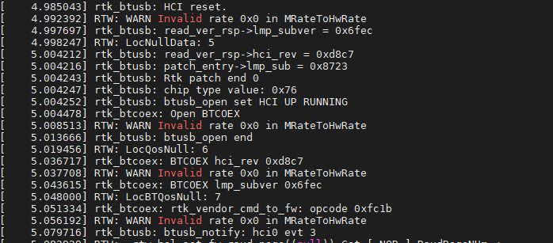
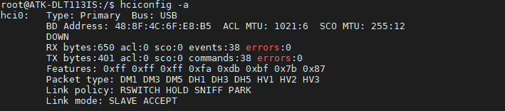
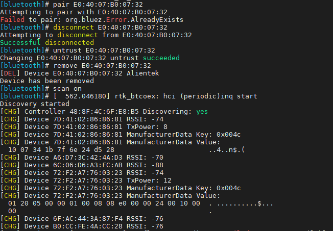
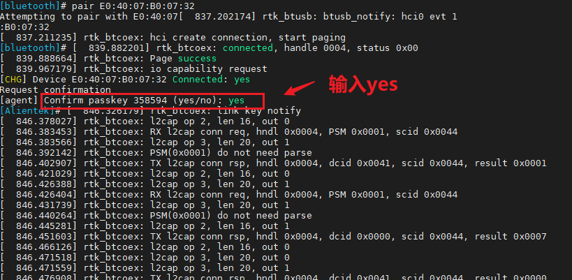
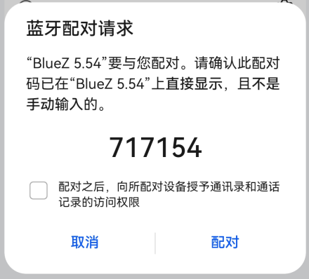
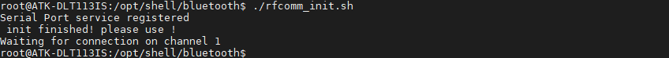
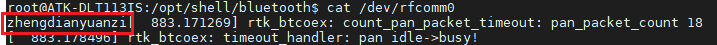
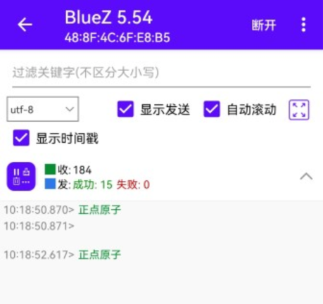

# 4.11 板载蓝牙测试

&emsp;&emsp;从启动打印信息可以看到蓝牙驱动已经加载上了。

<center>
<br />
图 4.11.1 蓝牙初始化信息
</center>

&emsp;&emsp;运行以下代码即可查看蓝牙功能是否开启：

```c#
hciconfig -a
```

<center>
<br />
图 4.11.2 查看蓝牙功能
</center>


## 4.11.1 蓝牙配对

&emsp;&emsp;蓝牙配对需要用到 bluetoothd 服务，bluetoothd 作为系统服务在后台运行，负责管理蓝牙适配器和处理蓝牙设备的连接、配对和通信。它是 Linux 系统中与蓝牙相关的核心组件之一。bluetoothd 存放在/usr/libexec/bluetooth 目录下，我们执行下面命令在后台开启服务。

```c#
/usr/libexec/bluetooth/bluetoothd -C &
```

&emsp;&emsp;输入下面指令，进入 bluetoothctl 交互模式。 

```c#
bluetoothctl 
```

&emsp;&emsp;依次执行下面指令。

```c#
power on					#打开电源
agent on					#开启代理
discoverable on			#开启可被检测
scan on					#开启扫描设备
```

<center>
<br />
图 4.11.3 bluetoothctl 交互模式
</center>

&emsp;&emsp;等到扫描到自己的蓝牙设备，输入 scan off 停止扫描。 

```c#
scan off 
```

&emsp;&emsp;扫描到自己的蓝牙设备，确认后就可以进行配对了。输入以下指令进行配对。

```c#
pair E0:40:07:B0:07:32			#填写自己的蓝牙MAC
```

<center>
<br />
图 4.11.4 蓝牙配对
</center>

&emsp;&emsp;手机也弹出配对码。

<center>
<br />
图 4.11.5 手机配对码
</center>

&emsp;&emsp;然后输入 exit 退出交互模式

```c#
exit
```

&emsp;&emsp;如果出现蓝牙连接了无效果或者失败， 可以清理一下 bluetoothctl 里面的蓝牙信息， 重新scan on 连接： 

```c#
devices                            #查看已匹配的蓝牙
disconnect E0:40:07:B0:07:32       #命令用于断开与特定蓝牙设备的连接
untrust	E0:40:07:B0:07:32          #将一个蓝牙设备从信任列表中移除
remove E0:40:07:B0:07:32           #配对列表中移除一个蓝牙设备
```

## 4.11.2 蓝牙rfcomm

&emsp;&emsp;蓝牙 RFCOMM 是一种蓝牙协议，它提供了一种串行数据传输的方式，可以在蓝牙设备之间进行数据传输。 RFCOMM 可以将串行数据转换为蓝牙的数据包，从而实现无线传输。

&emsp;&emsp;RFCOMM 提供了一种虚拟串口的概念，使得蓝牙设备之间的数据传输可以像串口一样进行。这种方式广泛应用于蓝牙耳机、蓝牙打印机等设备上。
在使用 RFCOMM 进行数据传输时，需要先建立蓝牙连接，并且指定 RFCOMM 通道。然后，在连接两端的设备中，可以通过 RFCOMM 发送和接收数据。这种方式适用于需要进行串口通信的应用场景，例如无线控制器、无线传感器等。
	
&emsp;&emsp;笔 者 编 写 了 开 启 蓝 牙 rfcomm 建 立 rfcomm 通 道 的 脚 本 ， 位于 /opt/shell/bluetooth/rfcomm_init.sh。脚本的内容如下。 

```c#
if [[ "$(pidof rfcomm)" != "" ]]
	then
	kill -9 $(pidof rfcomm)
	fi
	hciconfig hci0 piscan
	hciconfig hci0 noauth
	sleep 1
	sdptool add SP
	sleep 1
	rfcomm watch hci0 &
	echo "rfcomm init finished! please use bluetoothctl cmd to pair your device and then connect it!" 
```

&emsp;&emsp;执行 rfcomm_init.sh 脚本，可以看到已经创建了通道 1，等待连接。 

```c#
rfcomm_init.sh 
```

<center>
<br />
图 4.11.6 建立rfcomm通道
</center>

&emsp;&emsp;此时我们需要进行蓝牙配对，然后使用安卓手机“蓝牙调试宝” App 进行连接。苹果手机没有类似软件。 

## 4.11.3 蓝牙通信测试

&emsp;&emsp;安卓手机安装蓝牙调试宝，打开软件后，已经配对和未配对的蓝牙会显示在列表里（如果搜索不到，可能是需要再开启被扫描）。需要执行 discoverable on 或者退出交互终端后执行 hciconfig hci0 piscan 再次开启。蓝牙调试宝，打开软件后，已经配对蓝牙显示如下图。

<center>
<br />
图 4.11.7 配对蓝牙显示
</center>

&emsp;&emsp;板子接收数据可以使用 cat 指令进行收数据

```c#
cat /dev/rfcomm0
```

<center>
<br />
图 4.11.8 开发板接收数据
</center>

&emsp;&emsp;同理，我们可以向手机发送数据，执行下面指令 

```c#
echo "正点原子" > /dev/rfcomm0
```

<center>
<br />
图 4.11.9 开发板发生数据
</center>

&emsp;&emsp;注意，笔者在测试时发现不品牌的手机可能会出现蓝牙调试宝连接不上问题，如果出现这样的问题，可自行尝试用其他测试方式。


