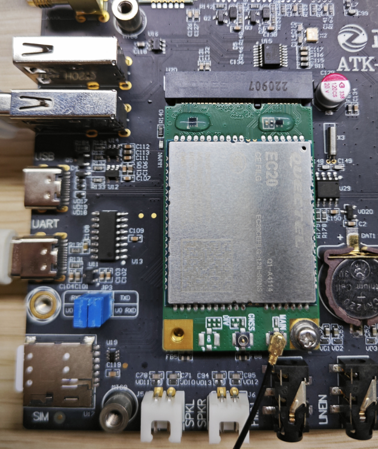
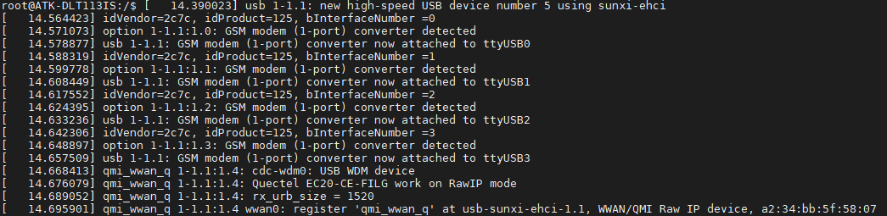
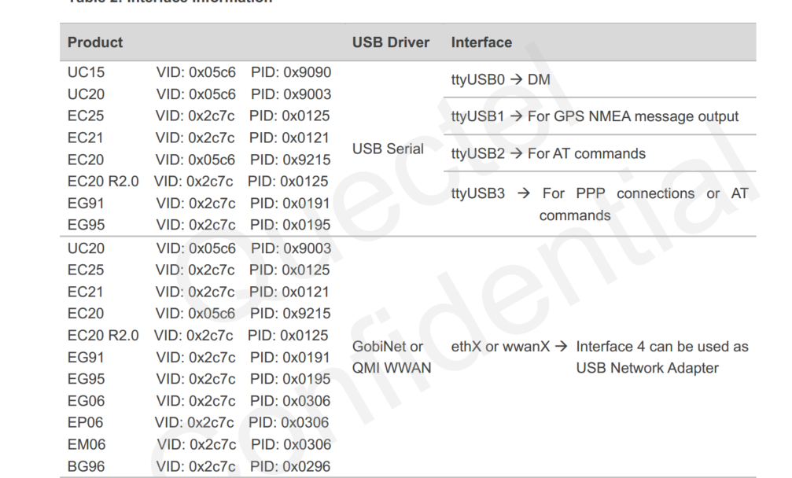
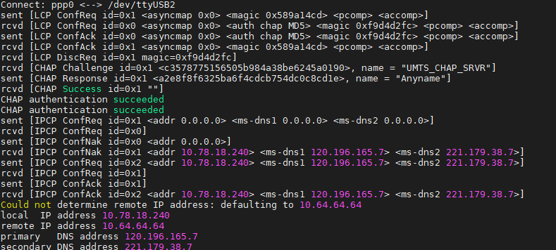
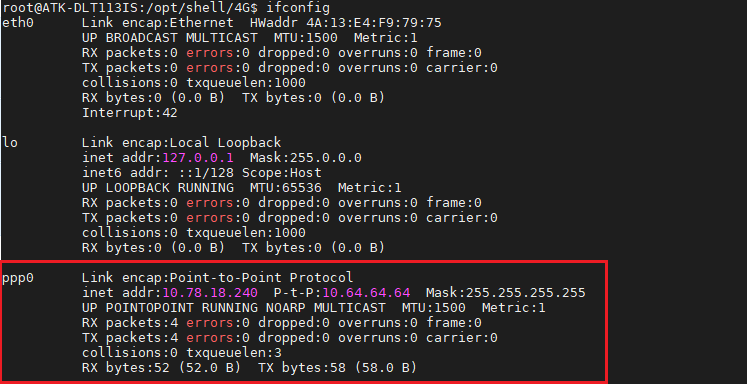
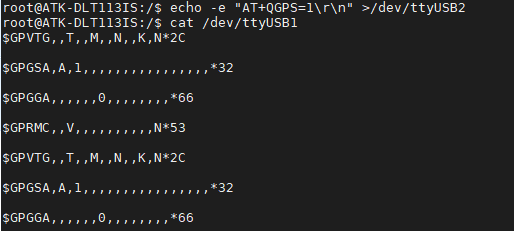

# 4.12 4G模块EC20测试

&emsp;&emsp;移远EC20 4G模块是一款高性能、高可靠性的无线通信模块，专为嵌入式系统而设计。它支持4G LTE网络，具备出色的数据传输速度和稳定性，可广泛应用于物联网、车联网、工业自动化等领域。

&emsp;&emsp;默认状态下LED_WWAN对应的LED灯闪烁情况：

<div class="dlt113is_center-table-div">
<table class="dlt113is_center-table">
  <tr>
    <th>引脚工作状态</th>
    <th>所指示的网络状态</th>
  </tr>
  <tr>
    <td>慢闪(200ms高/1800ms低)</td>
    <td>找网状态</td>
  </tr>
  <tr>
    <td>慢闪(1800ms高/200ms低)</td>
    <td>待机状态</td>
  </tr>
  <tr>
    <td>快闪(125ms高/125ms低)</td>
    <td>数据传输模式</td>
  </tr>
  <tr>
    <td>高电平</td>
    <td>通话中</td>
  </tr>
</table>
</div>

&emsp;&emsp;实验前准备：EC20 4G模块、4 G上网卡和天线（用于放大信号）。

&emsp;&emsp;正点原子ATK-DLT113IS底板上预留4G模块接口，ME3630-W，EC20等4G模块的安装。准备EC20模块，**注意购买时需要买天线，单单模块是不能正常工作的！**（备注：EC20有许多类型模块，目前测试过的是EC20-CE模块，其中EC20-CE系列又有多种模块，不同的模块功能不一样，比如支持的运营商不一样，详细请咨询卖家），其他EC20系列请自行测试，理论上驱动一样，有需求找移远技术支持。）。将EC20 4G模块插到4G模块接口处，拧上螺丝。保证4G模块与座子接口吻合连接。请使用原装天线，把天线连接到4G模块的MAIN接口处。

&emsp;&emsp;1.正确插入4G卡及插好模块，开发板启动后底板上的WWAN LED 会亮绿灯。如果WWAN LED绿灯未亮起，请检查模块是否正确连接插入，4G卡是否插入，天线是否接好，**开发板是必须插上配带的12V电源**，不能只用串口USB_TTL供电。

&emsp;&emsp;2.进行 4G 模块测试前，将 4G 卡插到底板的SIM卡槽里，再插上EC20 4G模块，同时插上天线，天线接到模块的 MAIN 处。正确插入 4G 卡与天线后，开发板启动后底板上的WWAN LED 会亮绿灯，若此灯不亮，请检查 4G 卡是否插对位置，天线是否连接正确，再重插模块试试。必须插上开发板使用的电源！**否则供电不足，模块无法正常工作**。模块安装如下图所示：

<center>
<br />
图 4.12.1  EC20安装图
</center>

&emsp;&emsp;我们可以在串口打印信息看到如下打印信息：

<center>
<br />
图 4.12.2 EC20打印的USB信息
</center>

&emsp;&emsp;再查看是否生成/dev/ttyUSB0~3节点

```c#
ls /dev/ttyUSB*
```

<center>
<br />
图 4.12.3 查看USB生成的节点
</center>

&emsp;&emsp;这四路ttyUSB的功能如下图所示，不全部测试这些功能了，这里我们只测试上网功能。详细请自行参考EC20 4G模块手册。

<center>
<br />
图 4.12.4 四路ttyUSB的功能示意图
</center>


## 4.12.1 ppp拨号上网

&emsp;&emsp;进入“/opt/shell/4G”目录下，这个目录存放着4G模块的脚本，如果您没有看到4G目录，请自行重新更新出厂系统。

```c#
cd /opt/shell/4G
```

&emsp;&emsp;ppp拨号主要是ppp-on-1000、ppp-on-10010和ppp-on-10086。这三个脚本分别是不同的运营商配置的APN值不一样。ppp-on-1000、ppp-on-10010和ppp-on-10086分别是电信卡需要执行的脚本、联通卡需要执行的脚本和移动卡需要执行的脚本。

&emsp;&emsp;比如本次测试使用的是移动卡，那么执行的脚本是ppp-on-10086。

```c#
./ppp-on-10086 &
```

<center>
<br />
图 4.12.5 获取IP成功
</center>

&emsp;&emsp;使用ifconfig指令查看获取的ip地址。

```c#
ifconfig
```

<center>
<br />
图 4.12.6 EC20 PPP0获取到IP地址
</center>

&emsp;&emsp;通过ping www.baidu.com来测试是否能上网。-I参数是指定ppp0(4G网络)，按“Ctrl +c”结束ping。看到下图结果表明能上网。

```c#
ping www.baidu.com -I ppp0
```

<center>
<br />
图 4.12.7 PPP0 ping百度
</center>

## 4.12.2 GPS的测试

&emsp;&emsp;EC20还有一个GPS的功能，通过AT指令去设置开启GPS，本小节只教如何开启和查看原始的GPS数据，其它的AT指令移动公司的资料。

&emsp;&emsp;注意事项：图 4.12.1 EC20安装图中有个GPS天线接口，可以购买带有GPS天线版本的EC20，天线需要接到GPS接口。

&emsp;&emsp;4G模块正常初始化如下打印信息:

<center>
<br />
图 4.12.9 4G模块正常初始化
</center>

&emsp;&emsp;上图可以查看出来已经初始化4个串口接口了，运行以下指令进行使用GPS功能。

```c#
echo -e "AT+QGPS=1\r\n" >/dev/ttyUSB2 //通过echo命令把AT+QGPS=1数据发送到USB2
cat /dev/ttyUSB1
```

<center>
<br />
图 4.12.10 GPS原始数据
</center>

&emsp;&emsp;关闭GPS功能可以运行以下代码：可按“Ctrl + c”终止cat指令。

```c#
echo -e "AT+QGPSEND\r\n" >/dev/ttyUSB2
cat /dev/ttyUSB1
```

&emsp;&emsp;这个时候我们可以看到ttyUSB1串口不再打印GPS的原始数据了。


