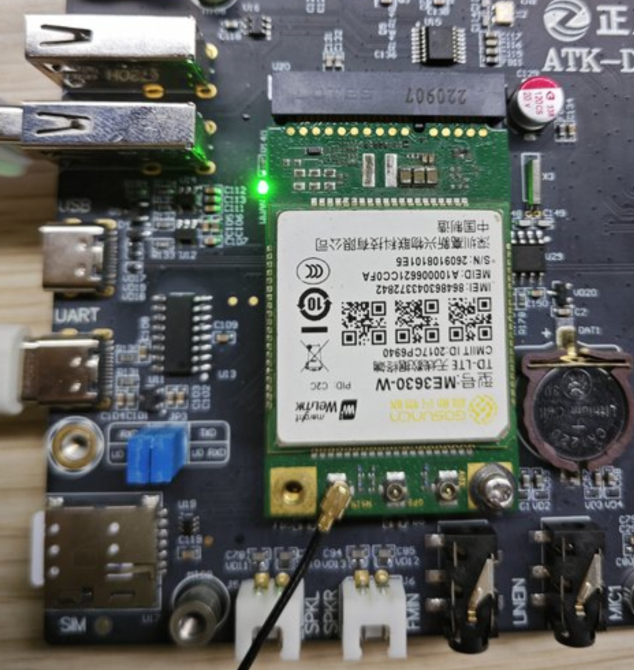
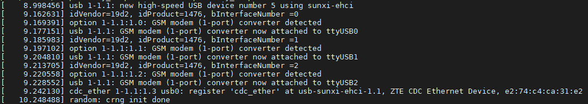
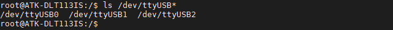
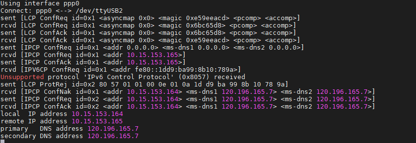
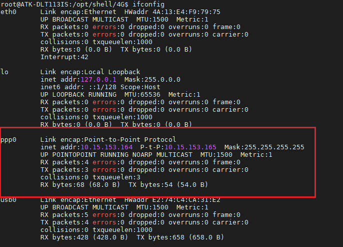
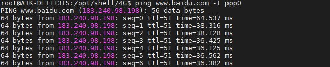
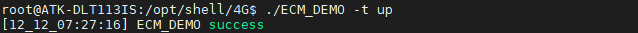
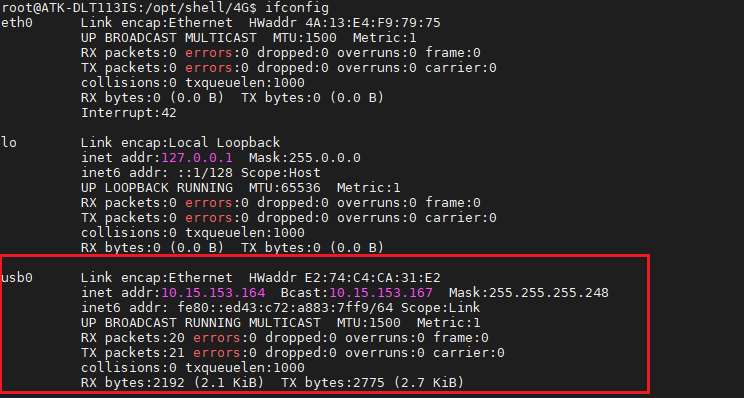

# 4.13 4G模块ME3630-W测试

&emsp;&emsp;正点原子ATK-DLT113IS上预留4G模块接口，ME3630-W，EC20等4G模块的安装。将ME3630-W模块插到4G模块接口处，拧上螺丝。保证4G模块与座子接口吻合连接。

&emsp;&emsp;请使用原装天线，把天线连接到4G模块的MAIN接口处。（温馨提示：4G模块在开封使用后，金手指容易氧化，时间长了上面会有一层氧化膜，如果多次实验不成功，请检查4G模块是否插好，或者是否有氧化膜。使用后请保存好4G模块！）

&emsp;&emsp;正确插入4G卡（支持移动、联通、电信4G卡）及插好模块，开发板启动后底板上的WWAN LED 会亮绿灯。如果WWAN LED绿灯未亮起，请检查模块是否正确连接插入，4G卡是否插入。

<center>
<br />
图 4.13.1 ME3630安装图
</center>

&emsp;&emsp;正常接上4G模块后，有以下打印信息

<center>
<br />
图 4.13.2 ME3630-W初始化信息
</center>

&emsp;&emsp;4G模块正常加载后，可以在/dev/下看到有3个ttyUSB*生成。4G模块通AT指令访问/dev/ttyUSB2进行通信。

```c#
ls /dev/ttyUSB*
```

<center>
<br />
图 4.13.3 查看ttyUSB节点
</center>

## 4.13.1 pppd拨号上网

&emsp;&emsp;出厂文件系统/opt/shell/4G目录下已经存放有测试4G模块相关脚本。新建一个目录，用于下面的脚本运行时生成DNS客户机配置文件。

```c#
mkdir /etc/ppp/		#如果已经存在，则不用重复创建
```

&emsp;&emsp;进入/opt/shell/4G目录下。

```c#
cd /opt/shell/4G
```

&emsp;&emsp;使用ls指令可以看到此路径下有多个脚本文件，如果没有这样的文件，请及时更新系统。

&emsp;&emsp;执行下面ppp-on脚本，&的作用是后台运行

```c#
./ppp-on-10086 &
```

<center>
<br />
图 4.13.4 PPP拨号上网获取IP地址
</center>

&emsp;&emsp;使用ifconfig可查看4G模块的网络名称。

<center>
<br />
图 4.13.5 ppp0网卡
</center>

&emsp;&emsp;ping百度测试连通性，-I是指定网卡。看到如下结果，有数据回复表示连通。按“Ctrl +c”终止指令。

```c#
ping www.baidu.com -I ppp0
```

<center>
<br />
图 4.13.6 ME3630-W上网测试
</center>

## 4.13.2 ECM上网

&emsp;&emsp;在操作系统看来，CDC ECM设备就是一个虚拟以太网卡，包含标准网卡需要的MAC地址和IP地址。

&emsp;&emsp;ECM_DEMO_AUTO 和 ECM_DEMO是高新兴ECM上网的程序（我们不需要知道源码，因为它只是一个工具），指令简介如下：

```c#
./ECM_DEMO -t up         //开启ecm上网 
./ECM_DEMO -t down       //关闭ecm上网
./ECM_DEMO -t up -p /dev/ttyUSB1 -a 3gnet  //开启的同时指定对应的apn和拨号端口
./ECM_DEMO -t down -p /dev/ttyUSB1     //关闭ecm上网
```

&emsp;&emsp;参数可以查看源代码或者执行 ECM_DEMO -h  查看

&emsp;&emsp;ECM_DEMO_AUTO 和 ECM_DEMO参数是一样的，区别是ECM_DEMO执行完流程就会退出，ECM_DEMO_AUTO会一直运行并每隔一段时间会检查是否断网，断网了会自动重连

&emsp;&emsp;ECM_DEMO_AUTO默认会自动执行拨号流程，故适合做开机自启的程序。

&emsp;&emsp;要配置ECM模式上网，如果运行了pppd上网，请先执行disconnect脚本断开pppd拨号上网，再执行下面的指令配置成ECM模式链接网络。

```c#
./disconnect
./ECM_DEMO -t up
```

<center>
<br />
图 4.13.7  ecm-on上网
</center>

&emsp;&emsp;用ifconfig指令查看获取的ip地址，如果没有获取到ip地址使用udhcpc -i usb0获取。

```c#
ifconfig
```

<center>
<br />
图 4.13.8 usb0节点
</center>

&emsp;&emsp;我们可以指点usb0节点去ping百度。

```c#
ping www.baidu.com -I usb0
```


