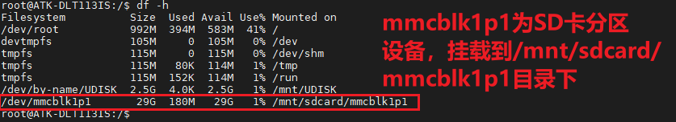
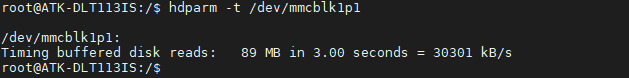
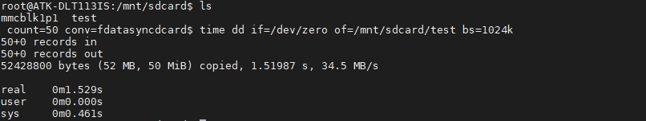

# 4.14 TF(SD)卡测试

&emsp;&emsp;指令提示： 

&emsp;&emsp;time 命令常用于测量一个命令的运行时间，dd 用于复制，从 if(input file)文件读出，写到 of(output file)指定的文件，bs 是每次写块的大小，count 是读写块的数量。"if=/dev/zero"不产生 IO，即可以不断输出数据，因此可以用来测试纯写速度。

&emsp;&emsp;开发板启动后将 TF 卡插到开发板底板卡槽处。开发板会将 TF 卡自动挂载。（注意需要使用 FAT32 格式的 TF 卡，不能使用 NTFS 格式）。使用 df -h 命令确定SD 挂载的分区。运行结果如下所示：


<center>
<br />
图 4.14.1 df -h查看分区
</center>

&emsp;&emsp;读取速度测试

&emsp;&emsp;常用于测试硬盘读取速度指令有 hdparm 与 dd，本次只演示 hdparm 读取 TF 卡的速度。(读取速度与你所用的 TF 卡类型有关)

```c#
hdparm -t /dev/mmcblk1p1
```

<center>
<br />
图 4.14.2 读测试
</center>

&emsp;&emsp;可以看出读取速度为 30301KB/s。<br />
&emsp;&emsp;写速度测试

```c#
time dd if=/dev/zero of=/mnt/sdcard/test bs=1024k count=50 conv=fdatasync
```

<center>
<br />
图 4.14.3 写测试
</center>

&emsp;&emsp;测试完成删除“/mnt/sdcard”目录下的 test 文件。


