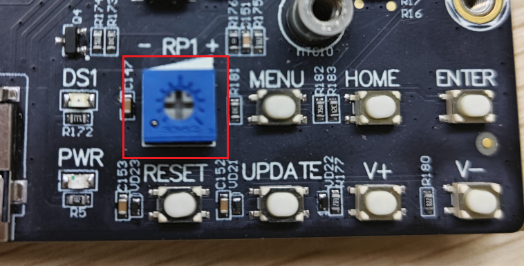
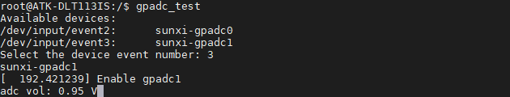

# 4.15 GPADC测试

&emsp;&emsp;注意： ADC 的采集电压绝对值最大是 1.8V，请不要超过 1.8V，否则可能对芯片造成损坏。ATK-DLT113IS 底板上 RP1 处有一路 ADC 方便用户测试。 电位器连接 GPADC1 接口，如下图所示： 

<center>
<br />
图 4.15.1 电位器图
</center>

&emsp;&emsp;在出厂系统中有，有测试GPADC电压值的工具，可执行下列命令查看GPADC的电压值：

```c#
gpadc_test
```

<center>
<br />
图 4.15.2 查看GPADC电压值
</center>


