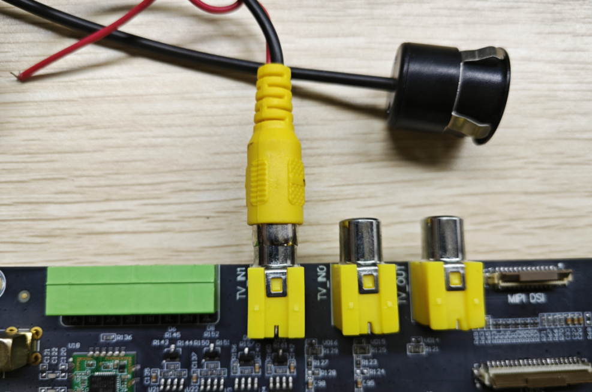
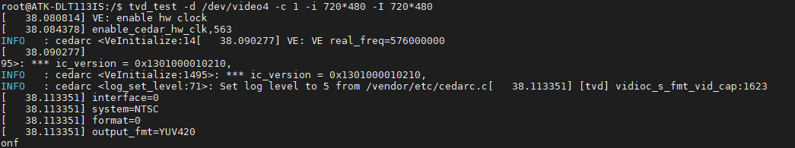
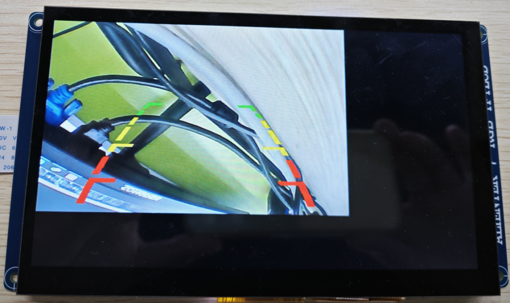

# 4.16 CVBS IN接口测试

&emsp;&emsp;测试CVBS IN摄像头接口需要准备一个支持NTSC制式的模拟摄像头。

&emsp;&emsp;摄像头模块接到开发板的TV_IN1接口，与开发板的连接如下图所示：（测试中用到的屏幕为RGB 屏幕）


<center>
<br />
图 4.16.1 连接开发板
</center>

&emsp;&emsp;开发板中有tvd_test测试工具，可以用于测试该接口，执行如下指令将摄像头数据显示在屏幕上。

```c#
fbinit
tvd_test -d /dev/video4 -c 1 -i 720*480 -I 720*480
```

<center>
<br />
图 4.16.2 tvd_test测试
</center>

&emsp;&emsp;执行成功后屏幕上将显示摄像头数据。

<center>
<br />
图 4.16.3 摄像头画面
</center>


