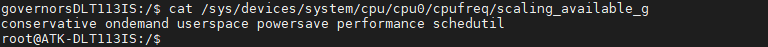

# 4.18  CPU频率

&emsp;&emsp;ATK-DLT113IS开发板处理器最高支持1.4GHz主频。运行以下命令查看CPU支持那些动态模式：

```c#
cat /sys/devices/system/cpu/cpu0/cpufreq/scaling_available_governors
```

&emsp;&emsp;运行结果如下图所示：


<center>
<br />
图 4.18.1  查看CPU的工作模式
</center>

&emsp;&emsp;图中可以看出，一共支持6种模式：conservative、ondemand、userspace、powersave、performance和schedutil。

&emsp;&emsp;- ondemand模式：(按需模式)此模式下，CPU频率会根据系统的负载情况动态调整。当系统负载较低时，CPU频率会降低以节省能量；当系统负载较高时，CPU频率会提高以提供更好的性能。

&emsp;&emsp;- userspace模式：(用户态模式)在这种模式下，用户可以手动控制CPU的频率。用户可以通过特定的工具或命令来设置CPU的频率，而不依赖于系统自动调节。

&emsp;&emsp;- performance模式：(性能模式)这是一种高性能模式，CPU会工作在最高频率，以提供最大的计算能力。这个模式适用于需要最大性能的任务，但可能会消耗更多的能量。

&emsp;&emsp;- schedutil模式：(调度器模式)这是Linux内核中较新的一种调度器模式，它尝试根据系统的工作负载动态选择合适的CPU频率。它的目标是在提供良好性能的同时，尽量减少能耗和热量。

&emsp;&emsp;查看当前运行CPU频率

```c#
cat /sys/devices/system/cpu/cpu*/cpufreq/cpuinfo_cur_freq  //查看当前运行 CPU 频率
cat /sys/devices/system/cpu/cpu*/cpufreq/scaling_cur_freq  //查看软件上最后一次设置的 CPU 频率 
cat /sys/devices/system/cpu/cpufreq/policy0/scaling_available_frequencies    //查看支持的 CPU 频率 
echo performance > /sys/devices/system/cpu/cpufreq/policy0/scaling_governor  //使能 CPU 性能模式，跑最高频 
echo userspace > /sys/devices/system/cpu/cpufreq/policy0/scaling_governor    //切换 governor 到 userspace
echo 1008000 > /sys/devices/system/cpu/cpufreq/policy0/scaling_setspeed      //设置CPU 频率需要先切换到 userspace
```


