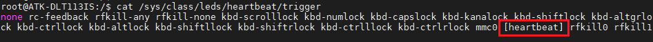

# 4.1 LED测试

&emsp;&emsp;ATK-DLT113IS开发板配备了两个LED灯，一个蓝色的系统电源灯，一个黄绿色的用户LED灯。

&emsp;&emsp;在出厂系统输入如下指令，控制用户LED灯（DS1）。查看当前系统的DS1灯的触发方式

```c#
cat /sys/class/leds/heartbeat/trigger	 //查看DS1的当前触发方式及支持的触发方式
```

&emsp;&emsp;运行结果如下图所示：

<center>
<br />
图 4.1.1 查看触发方式
</center>

&emsp;&emsp;可以看出此时的DS1，触发方式为[heartbeat]表示当前的触发条件为系统心跳灯，修改trigger的字符串即可修改触发方式。命令如下所示：

```c#
echo none > /sys/class/leds/heartbeat/trigger //改变DS1的触发方式，设置为none
``` 

&emsp;&emsp;以下命令进行控制DS1灯。

```c#
echo 1 > /sys/class/leds/heartbeat/brightness //点亮DS1
echo 0 > /sys/class/leds/heartbeat/brightness //熄灭DS1
```


