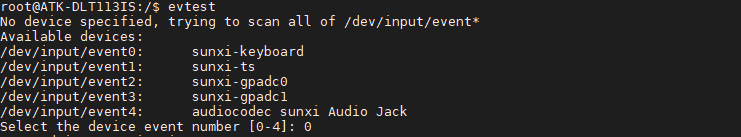
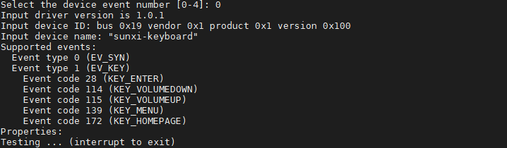
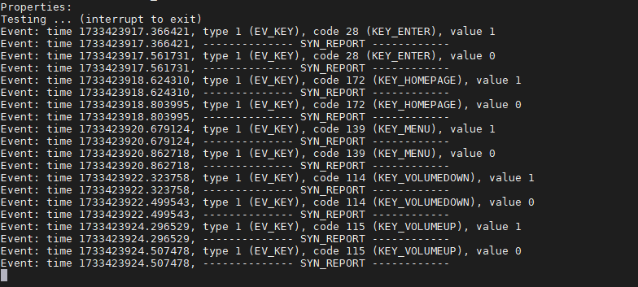

# 4.2 按键测试

&emsp;&emsp;ATK-DLT113IS开发板配备了七个按键，其中一路为复位按键，一路为烧录按键，另外五路为同一个LRADC引脚引出的ADC按键。

&emsp;&emsp;在出厂系统输入如下指令，控制ADC按键。命令如下：


```c#
evtest
```

<center>
<br />
图4.2.1 evtest界面
</center>

&emsp;&emsp;在图4.2.1中，告诉我们“/dev/input/event0”为gpio-keyboard的中断事件，直接输入0即可(**如果有多个输入设备的时候编号可能发生改变，需要根据实际情况输入编号**)

<center>
<br />
图4.2.2 按键键值
</center>

&emsp;&emsp;在图4.2.2中，红色框表示按键上报的按键值。按下按键即可出现内核的打印信息。如下图所示：

<center>
<br />
图4.2.3 按键测试
</center>


