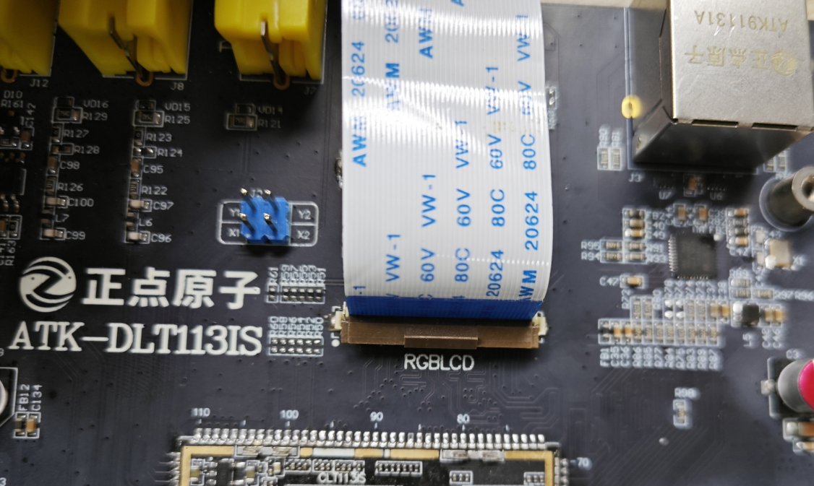
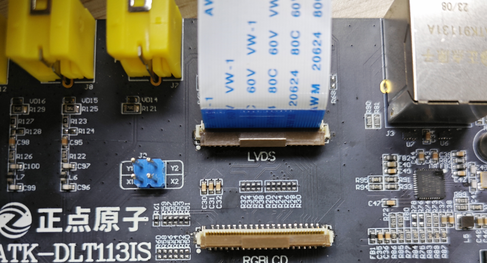
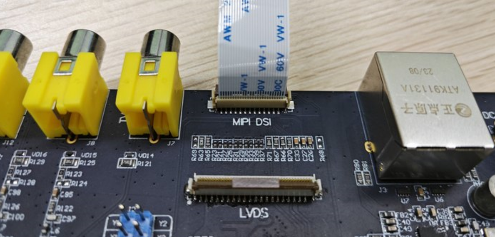
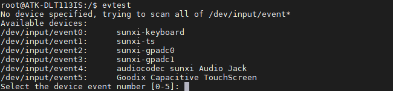

# 4.3  LCD测试

&emsp;&emsp;ATK-DLT113IS开发板有三个硬件显示接口RGB（RGB666）、LVDS和MIPI DSI。

## 4.3.1  RGB 接口测试

&emsp;&emsp;正点原子的RGB屏幕兼容RGB565可以直接使用RGB屏幕。由于正点原子屏幕在R、G和B数据线的最高位R7\G7\B7的默认高低电平状态识别不同屏幕的分辨率。正点原子所使用的RGB屏幕有5种，如下表格所示：

<div class="dlt113is_center-table-div">
<table class="dlt113is_center-table">
  <tr>
    <th>屏幕尺寸</th>
    <th>触摸芯片</th>
    <th>屏幕ID识别码</th>
  </tr>
  <tr>
    <td>4.3寸屏(480x272)</td>
    <td>gt9xx</td>
    <td>0x00</td>
  </tr>
  <tr>
    <td>4.3寸屏(800x480)</td>
    <td>gt9xx</td>
    <td>0x04</td>
  </tr>
  <tr>
    <td>7寸屏(800x480)</td>
    <td>gt9xx</td>
    <td>0x01</td>
  </tr>
  <tr>
    <td>7寸屏(1024x600)</td>
    <td>gt9xx</td>
    <td>0x02</td>
  </tr>
  <tr>
    <td>10寸屏(1280x800)</td>
    <td>gt9xx</td>
    <td>0x05</td>
  </tr>
</table>
</div>

&emsp;&emsp;EMMC版本开发板出厂系统烧录的镜像为atk_dlt113is_buildroot_rgb-7-600p_uart0.img，NAND版本出厂系统烧录的镜像为atk_dlt113is_nand_buildroot_rgb-7-600p_uart0.img。

&emsp;&emsp;因此开发板出厂系统接7寸RGB屏(1024x600)启动就可以点亮屏幕。硬件解法如下图所示：（棕色卡扣往上拨是松开卡扣取出排线，往下压是按紧卡扣固定排线）

<center>
<br />
图 4.3.1 RGB接口
</center>

## 4.3.2  LVDS 接口测试

&emsp;&emsp;在测试LVDS屏幕前我们需要烧录对应屏幕的固件，EMMC版本开发板烧录的固件为`开发板光盘A盘-基础资料\08、系统镜像\EMM\atk_dlt113is_buildroot_lvds_uart0.img`，NAND版本开发板烧录的固件为`开发板光盘A盘-基础资料\08、系统镜像\NAND\atk_dlt113is_nand_buildroot_lvds_uart0.img`。烧录步骤可参考第三章内容。

&emsp;&emsp;烧录完系统后，接好屏幕，重启开发板即可点亮屏幕，硬件连接图如下所示：（棕色卡扣往上拨是松开卡扣取出排线，往下压是按紧卡扣固定排线）

<center>
<br />
图 4.3.2 LVDS接口
</center>

## 4.3.3  MIPI DSI 接口测试

&emsp;&emsp;在测试MIPI屏幕前我们需要烧录对应屏幕的固件，正点原子有三款MIPI屏幕，分别为5.5寸720p MIPI屏，5.5寸1080p MIPI屏和10.1寸800p MIPI屏。不同的屏幕需要烧录不同的固件，EMMC版本开发板固件路径为`开发板光盘A盘-基础资料\08、系统镜像\EMMC`，NAND版本开发板固件路径为`开发板光盘A盘-基础资料\08、系统镜像\NAND`，不同屏幕与固件的搭配如下表所示：

| 屏幕/开发板      | EMMC版本                                         | NAND版本                                             |
| :--------------: | :----------------------------------------------- | :--------------------------------------------------- |
| 5.5寸720p MIPI屏 | atk_dlt113is_buildroot_mipi-5p5-720p_  uart0.img | atk_dlt113is_nand_buildroot_mipi-5p5-720p_uart0.img  |
| 5.5 1080p MIPI屏 | atk_dlt113is_buildroot_mipi-5p5-1080p_uart0.img  | atk_dlt113is_nand_buildroot_mipi-5p5-1080p_uart0.img |
| 10.1 800p MIPI屏 | atk_dlt113is_buildroot_mipi-10p1-800p_uart0.img  | atk_dlt113is_nand_buildroot_mipi-10p1-800p_uart0.img |


&emsp;&emsp;烧录步骤可参考第三章内容。烧录完系统后，接好屏幕，重启开发板即可点亮屏幕，硬件连接图如下所示：（棕色卡扣往上拨是松开卡扣取出排线，往下压是按紧卡扣固定排线）

<center>
<br />
图 4.3.3 MIPI DSI接口
</center>

## 4.3.4 触摸测试

&emsp;&emsp;触摸测试很简单和按键一样使用evtest命令测试，在开发板的调试终端下，输入如下命令：

```c#
evtest
```
<center>
<br />
图 4.3.4 evtest工具
</center>

&emsp;&emsp;/dev/input/event5为RGB屏触摸测试设备。测试RGB屏幕触摸直接输入5。

## 4.3.5 背光测试

&emsp;&emsp;在默认出厂系统，RGB、LVDS和MIPI屏幕背光都支持256个等级的PWM调节，亮度级数为0~255，默认255.设置为0时，关闭背光。数值越大，屏幕越亮。RGB屏幕测试代码如下：

```c#
cat /sys/class/backlight/backlight/max_brightness //查看LCD最大亮度等级
cat /sys/class/backlight/backlight/brightness	//查看当前亮度等级
echo 100 > /sys/class/backlight/backlight/brightness //修改当前亮度等级观察屏的亮度变化
cat /sys/class/backlight/backlight/brightness //查看当前亮度等级
```


