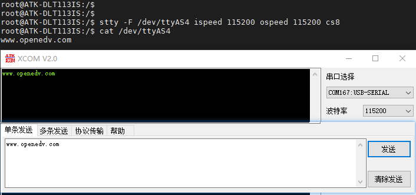

# 4.4 串口测试

&emsp;&emsp;ATK-DLT113IS开发板板载两个RS485（uart3和uart4)，在这里我们需要借助正点原子USB转换器模块来测试，如果用户有485相关测试工具可以自行测试，不一定要用这个模块。如下图。

<center>
<br />
图 4.4.1 正点原子多合一USB转换器模块
</center>

&emsp;&emsp;将底板的RS485的A用杜邦线连接到正点原子USB转换器模块的A处，B连接到B。使用了正点原子的USB转换器模块，会在PC(电脑端)看到一个串口。硬件连接如下图所示：

<center>
<br />
图 4.4.2 开发板与串口工具连接方式
</center>


&emsp;&emsp;通过下面的指令配置串口

```c#
stty -F /dev/ttyAS4 ispeed 115200 ospeed 115200 cs8
```

&emsp;&emsp;stty指令解释：<br />
&emsp;&emsp;（1）	-F(--file)：打开指定的设备,并用此设备作为输入来代替标准输入<br />
&emsp;&emsp;（2）	ispeed N：设置输入速率为N<br />
&emsp;&emsp;（3）	ospeed N： 设置输出速率为N<br />
&emsp;&emsp;（4）	csN：把字符长度设为N

&emsp;&emsp;更多关于该指令用法请输入stty -help查看

&emsp;&emsp;输入如下指令等待上位机发来的数据，注意不要发中文，否则可能会乱码。按Ctrl+c结束接收。

```c#
cat /dev/ttyAS4 
```

<center>
<br />
图4.4.3 串口接收数据
</center>

&emsp;&emsp;接收cat程序，使用以下命令发送数据到上位机：

```c#
echo www.openedv.com > /dev/ttyAS4
```

<center>
<br />
图4.4.4 串口发送数据
</center>


