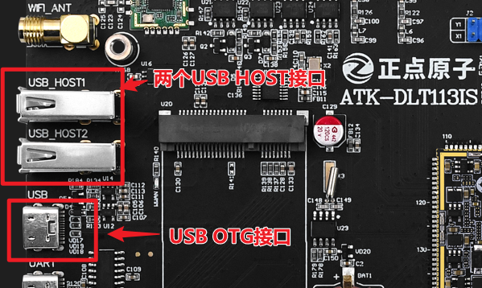
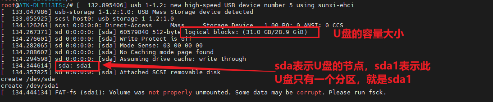
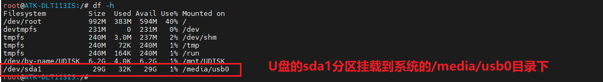
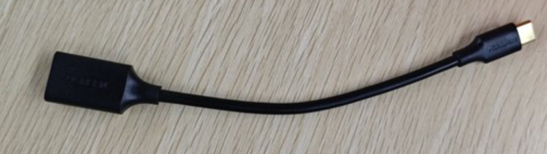
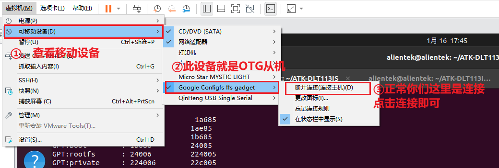
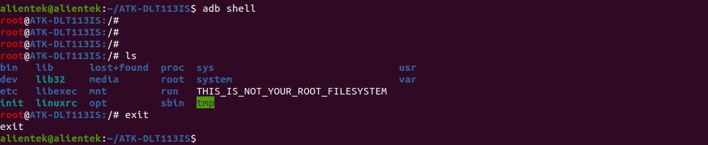

# 4.5 USB测试

&emsp;&emsp;T113i芯片有个两个usb接口，分别为：USB HOST和USB OTG。ATK-DLT113IS开发板把USB HOST使用CH334R转出4个USB HOST接口(两个当作普通的USB HOST，一个做了4G模块，一个做了usb WiFi)。USB OTG直接引出来当作开发板的OTG接口。

<center>
<br />
图 4.5.1 USB接口
</center>

## 4.5.1 USB HOST 测试

&emsp;&emsp;测试要求：准备一个U盘(FAT32格式)。开发板正常上电，接上调试串口。当我们把U盘接到USB HOST接口下就有以下打印信息：

<center>
<br />
图 4.5.2 USB初始化信息
</center>

&emsp;&emsp;看到上图的打印信息，说明U盘识别成功。这里笔者的U盘的格式为FAT32所以，可以自动挂载。运行以下命令查看是否挂载成功：

```c#
  df -h
```

<center>
<br />
图 4.5.3 USB设备挂载信息
</center>

## 4.5.2  USB OTG 测试
&emsp;&emsp;OTG HOST测试<br />

&emsp;&emsp;测试方法看4.5.1小节。需要一个typeC转typeA母口线。如下图：

<center>
<br />
图 4.5.4 typeC转typeA母口线
</center>

&emsp;&emsp;OTG 从机测试<br />

&emsp;&emsp;OTG 从机默认出厂系统当作ADB功能，全志提供此版本的ADB在Windows系统下不能用，不知道为啥。只能通过Ubuntu系统进行测试了，在Ubuntu系统下运行以下命令安装adb。

```c#
	sudo apt install adb
```

&emsp;&emsp;使用TYPC接口和电脑连接，在VMware的移动设备里面有一个“Google Configfsffs gadget”设备。把此接口连接到虚拟机下，成功如下图：

<center>
<br />
图 4.5.5 连接虚拟机
</center>

&emsp;&emsp;ADB常用的命令有三个：shell、push和pull，其它高级命令请自行百度研究。

&emsp;&emsp;1.	shell
```c#
adb shell
exit //退出终端
```

&emsp;&emsp;进入开发板的终端，此时的终端相对于调试串口。如下图所示：

<center>
<br />
图 4.5.6 adb shell
</center>

&emsp;&emsp;2.	push

```c#
adb push xxxx /
```

&emsp;&emsp;push表示拷贝文件到开发板上。这里“xxxx”表示要拷贝的文件，“/”表示拷贝到根目录。

&emsp;&emsp;3.	pull

```c#
adb pull xxxx ./
```

&emsp;&emsp;pull表示把开发板的文件拷贝到Ubuntu系统下，“xxxx”表示要拷贝的文件，“./”表示拷贝到Ubuntu系统下当前目录。


