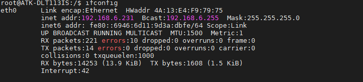
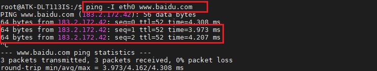
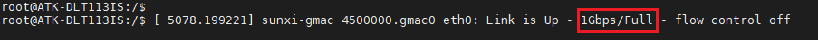
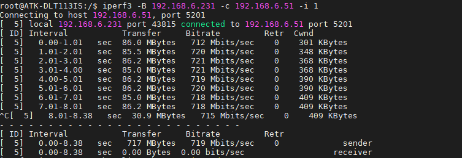

# 4.6  网络测试

&emsp;&emsp;ATK-DLT113IS开发板上搭载一颗千兆网络芯片，自适应10/100/1000M。在文件系统使用如下指令测试网络，将网线插在网口处，确保网线能上网。查看网络获取的IP

```c#
ifconfig
```

<center>
<br />
图 4.6.1 查看使能的网络节点eth0
</center>

&emsp;&emsp;检查网络能否上网，如果有数据回复，则说明网络功能正常。按Ctrl+c终止指令。

```c#
ping -I eth0 www.baidu.com 						//使用eth0网口ping百度
```

<center>
<br />
图 4.6.2 ping百度
</center>

&emsp;&emsp;测试是否为千兆网络，注意要使用千兆网线，千兆路由器或者千兆交换机，PC（电脑）网卡必须是千兆网卡，否则测试出来的速度或识别出来的速度可能是百兆的！如下图，看到软件识别为1Gbps/Full代表是千兆网络。

<center>
<br />
图4.6.3 识别为千兆网络
</center>

&emsp;&emsp;使用iperf3指令可测试千兆网络的连接速度

&emsp;&emsp;设置Ubuntu为服务器

```c#
iperf3 -s
```

&emsp;&emsp;ATK-DLT113IS为客户端，通过iperf3指令，输入服务器的ip即可

```c#
iperf3 -B 192.168.6.231 -c 192.168.6.51 -i 1
```

&emsp;&emsp;命令解释：<br />
&emsp;&emsp;	-B 192.168.6.104：客户端的IP地址，开发板有两个IP地址，需要指定一个地址。要不就默认从eth0网口出去。<br />
&emsp;&emsp;	-c 192.168.6.84：Ubuntu服务器的IP地址。<br />
&emsp;&emsp;	-i 1：触发周期，单位为秒。


<center>
<br />
图 4.6.4 千兆网络测试
</center>

&emsp;&emsp;如果没有测出千兆网速，请检查是否使用了千兆网线、PC电脑的网卡是不是千兆网卡，通过的路由器是不是千兆的等，不能有一个为百兆的设备，否则测试出来的是百兆网络。

&emsp;&emsp;**注意：实际测试跑不到理论值，速度请根据实际测试为准。**


