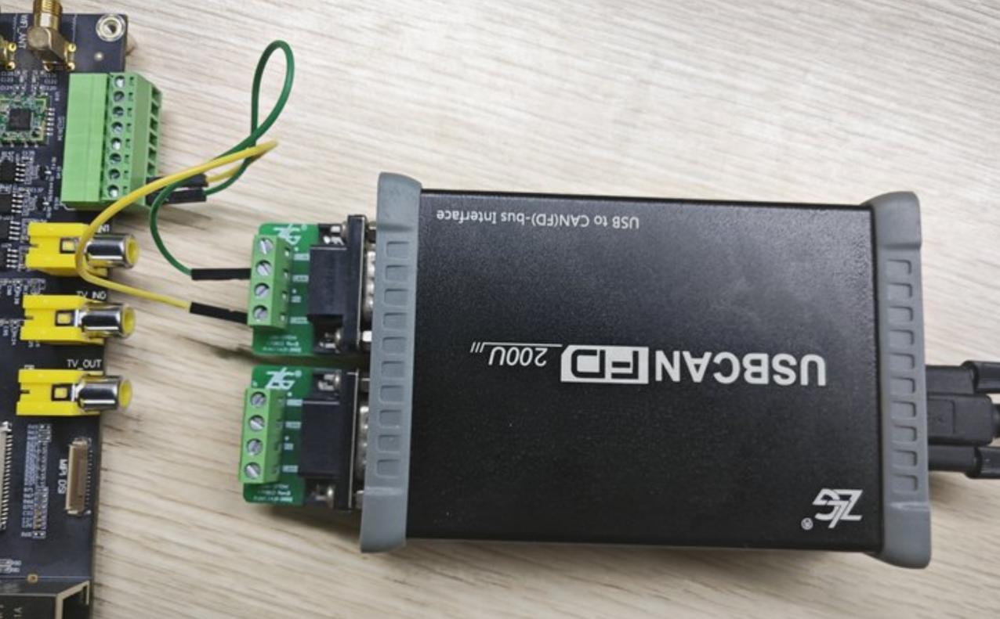
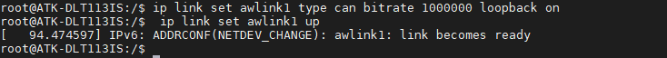
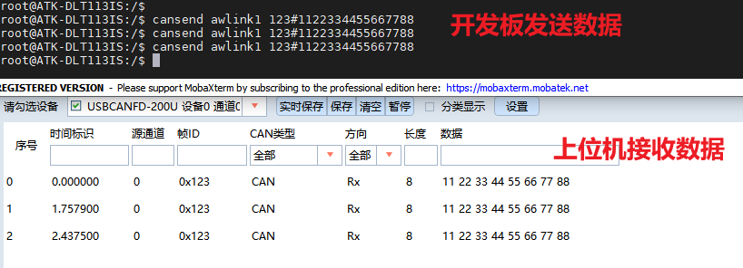
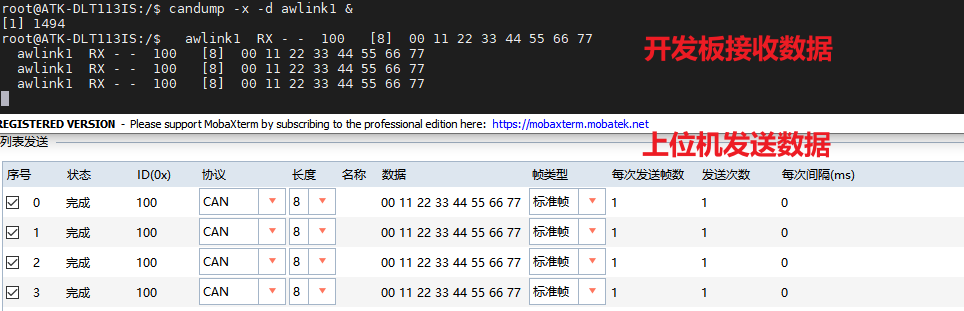

# 4.7 CAN测试

&emsp;&emsp;ATK-DLT113IS开发板上有两路CAN。测试CAN通信功能，用户手上需要有测试CAN的仪器（亦可以用两路can对接通信）比如周立功的CAN分析仪、创芯科技的CAN分析仪和广成科技的CAN分析仪等。关于CAN仪器及CAN上位机的使用，请参照各厂商的使用说明书，如不会使用请咨询CAN厂家的技术支持。

&emsp;&emsp;ATK-DLT113IS开发板的CAN主要特性如下：

&emsp;&emsp;1.支持行业标准的 AMBA 外设总线 （APB），并且与 AMBA 完全兼容规范。<br />
&emsp;&emsp;2.支持 APB 32 位总线宽度操作<br />
&emsp;&emsp;3.支持 CAN 2.0A 和 2.0B 协议规范<br />
&emsp;&emsp;4.测试前请使用CAN分析仪或者测试CAN的设备连接好ATK-DLT113IS开发板的	CAN接口，CANH接仪器的CANH，CANL接CAN仪器的CANL。<br />
&emsp;&emsp;5.本次测试用的是周立功的USBCANFD-200U。连接方式如下图所示：

<center>
<br />
图 4.7.1 USBCANFD-200U
</center>

&emsp;&emsp;设置can1的can设备通信波特率为1000000，也就是通信波特率1MBit/s。

```c#
ip link set awlink1 type can bitrate 1000000 loopback on 
```

&emsp;&emsp;打开can1设备

```c#
ip link set awlink1 up
```

<center>
<br />
图 4.7.2 打开CAN1设备
</center>

&emsp;&emsp;发送数据：<br />
&emsp;&emsp;CAN发送数据，输入以下指令：

```c#
cansend awlink1 123#1122334455667788
```

<center>
<br />
图 4.7.3 CAN通信
</center>

&emsp;&emsp;接受数据：<br />

&emsp;&emsp;接收则可以使用candump指令来接收数据：

```c#
candump -x -d awlink1 &
```

<center>
<br />
图 4.7.4 CAN通信
</center>


