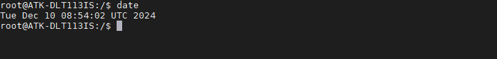
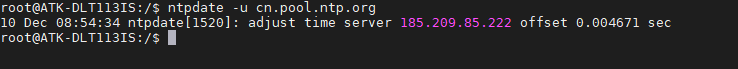
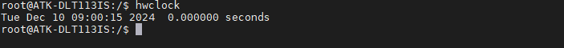

# 4.8  RTC时钟测试

&emsp;&emsp;ATK-DLT113IS开发板上有RTC时钟芯片PCF8563，属于芯片外部RTC时钟。若需要提高时钟的精度，需要用高精度的晶振。

&emsp;&emsp;请检查开发板底板上是否有安装RTC纽扣电池。也可以用万用表检查RTC电池有没有电，测出来是3.3v左右才是正常的。防止因RTC电池没电不能保存时间。（注意，电池属于易耗品，若没电请更换纽扣电池）

&emsp;&emsp;Linux系统分两个时钟，一个是system time（软件时钟），一个是hardware clock（硬件时钟）。使用date和hwclock命令可分别查看和设定系统时间和硬件时间。系统时钟掉电即会消失，RTC 时钟在有电池的情况下会长期运行。系统时钟会在系统重启时与 RTC 时钟同步。

&emsp;&emsp;查看系统时钟，使用指令date。(**只要开发板可以上网，系统的进程会自动更新时间**)

```c#
date
```

<center>
<br />
图 4.8.1 查看系统时间
</center>

&emsp;&emsp;如果没有自动更新时间（开发板能上网的情况下）可以执行如下指令：

```c#
ntpdate -u cn.pool.ntp.org
```

<center>
<br />
图 4.8.2 更新时间
</center>

&emsp;&emsp;不连接网线情况下可以执行下列指令设置当前系统时间

```c#
date -s "2024-12-10 10:00:00" 
```

&emsp;&emsp;设置RTC的硬件时间（将系统时间写进硬件时间）

```c#
hwclock -w
```

&emsp;&emsp;查看硬件时钟，检查是否是上面 hwclock -w 所设置的时钟。 

```c#
hwclock
```

<center>
<br />
图 4.8.3 硬件时间
</center>

&emsp;&emsp;**注意，系统时间和RTC时间的时区都为UTC，中国时间比UTC快了8小时，需要程序加8小时。**


