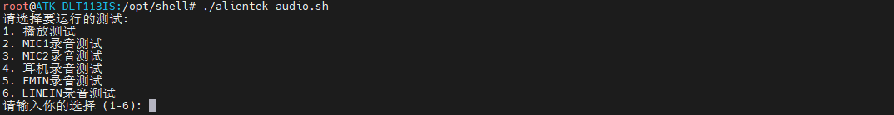
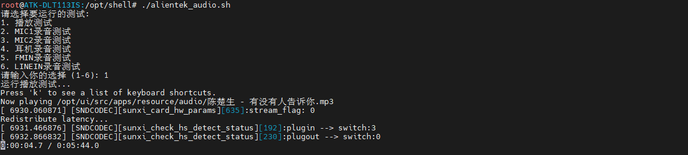
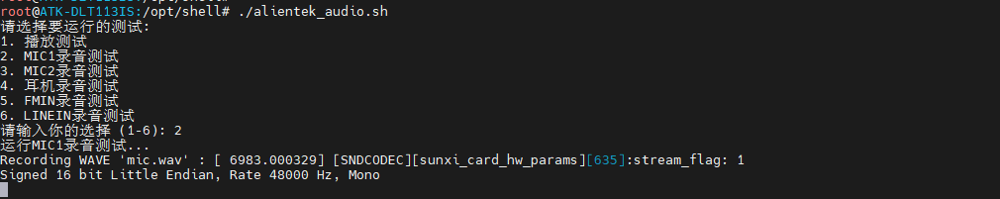

# 4.9  音频测试

&emsp;&emsp;出厂系统预装了音频测试脚本，用于在终端中快速运行音频测试以检验音频设备的工作状态。为了运行这个测试脚本，用户需要执行一系列步骤，首先跳转到特定的脚本存放目录(/opt/shell/audio)，然后执行脚本文件。命令如下所示：

```c#
cd /opt/shell/
./alientek_audio.sh
```

<center>
<br />
图 4.9.1 alientek_audio.sh脚本
</center>

&emsp;&emsp;输入1开始播放测试。

<center>
<br />
图 4.9.2 播放测试
</center>

## 4.9.2 录音测试

&emsp;&emsp;录音和播放一样，使用脚本即可录音，首先跳转到特定的脚本存放目录(/opt/shell/audio)，命令如下所示：

```c#
cd /opt/shell/
./alientek_audio.sh
```

<center>
<br />
图 4.9.3 选择对应配置
</center>

&emsp;&emsp;输入2开始板载MIC1录音测试，输入3开始板载MIC2录音测试，输入4开始耳机录音测试，输入5开始FMIN录音测试，输入6开始LINEIN录音测试。在选择后开始录音10秒，录完后自动播放录制的音频。

<center>
<br />
图 4.9.4 录音测试
</center>

