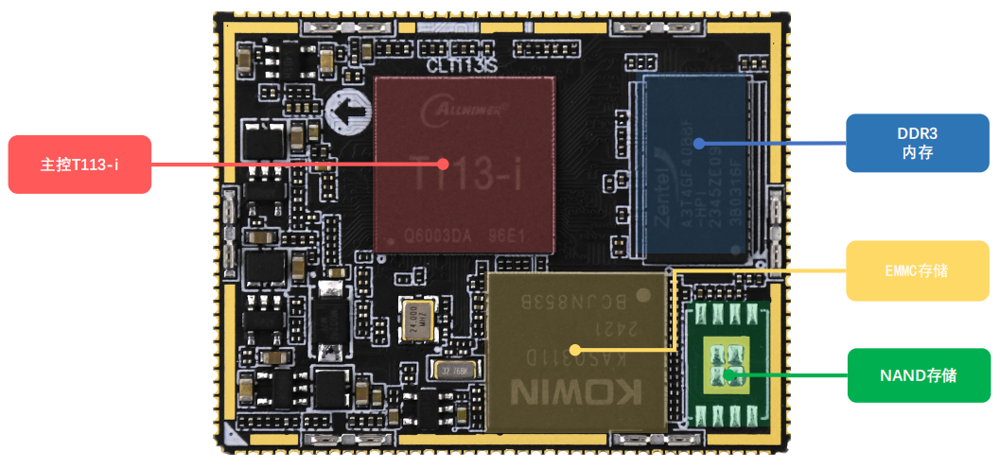

# 2.1 核心板硬件参数

|   **参数项**   |           **参数**            | **备注**                                                     |
| :------------: | :---------------------------: | :----------------------------------------------------------- |
|    尺寸规格    |           43mm*33mm           | 长*宽                                                        |
|      CPU       |            T113-i             | LFBGA                                                        |
|      内存      |         256/512MByte          | 贴片封装。受芯片供货影响，可能会有多种不同厂家的芯片，一切以实际贴片的型号为准。 |
|      存储      |  4/8GByte EMMC (256MB NAND)   | 贴片封装。受芯片供货影响，可能会有多种不同厂家的芯片，一切以实际贴片的型号为准。 |
|  电源管理芯片  |         电源管理芯片          |                                                              |
|    工作电压    |             3.3V              |                                                              |
|   功耗（1）    |             ≤1.6W             | 静态功耗，具体功耗取决于外设                                 |
|    运行温度    |        工业级-40℃~+85℃        |                                                              |
|    引脚间距    |              1mm              |                                                              |
| 核心板连接方式 |            邮票孔             |                                                              |
|    PCB工艺     | 8层，沉金工艺，独立接地信号层 | 采用无铅工艺                                                 |

&emsp;&emsp;注：（1）核心板的功耗数据是由环境12V/1.0A输入，只接串口UART1，不接其他外设。具体功耗数据取决于底板所接的外设。

 
图 2.1.1 核心板资源图

