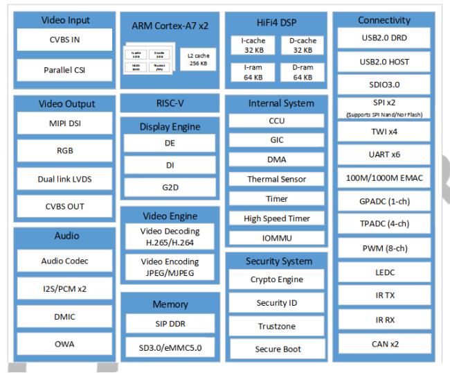

# 2.2 T113-i芯片参数

 
图 2.2.1 芯片框图

&emsp;&emsp;T113-i芯片具体功能请参考T113-i芯片数据手册。

&emsp;&emsp;**T113-i主控芯片资源**

|     处理器      | 2x Cortex-A7，1.2GHz 1x RISC-V 1x HiFi4 DSP        |
| :-------------: | :----------------------------------------------------------- |
|     Decoder     | ×1，MPEG-/2/4/65/H.264/H.263/JPEG/Xvid/Sorenson Spark decoding |
|     Encoder     | JPEG/MJPEG encoding, up to 1080p@60fps                       |
|      EMAC       | ×1，10/100/1000 Mbit/s Ethernet port with RGMII and RMII interfaces |
|       RGB       | ×1，最高支持1920x1080@60fps                                  |
|    MIPI DSI     | ×1，支持4线MIPI DSI，最高支持1920 x 1200@60fps               |
|      LVDS       | ×2，支持2个4lane LVDS；最高支持1920x1080@60fps；             |
| AUDIO CODE | ×2，DAC通道，采样率8KHz~192KHz； ×3，ADC通道，采样率8KHz~48KHz； 一路立体声LINE IN、一路立体声FM IN； |
|      UART       | ×6，支持4Mbps波特率（64MHz APB时钟）                         |
|       CAN       | ×2，支持CAN 2.0A和CAN 2.0B协议                               |
|       CSI       | ×1，支持8位DVP并行接口； 支持2*1080p@30fps              |
|    TWI(IIC)     | ×4，支持标准模式100Kbit/s、高速模式400Kbit/s                 |
|       SPI       | ×2，支持全双工模式； 支持主从模式； 注：一路用于spi NAND未引出到核心板 |
|       PWM       | ×8，支持0~24MHz或100MHz； 支持0~100%可调占空比； 支持PWM输出、输入捕获； |
|    CVBS OUT     | ×1，支持NTSC、PAL制式                                        |
|     CVBS IN     | ×2，支持NTSC、PAL制式                                        |
|     USB 2.0     | ×2，一路USB OTG，一路USB HOST                                |
|      SMHC       | ×3，支持 eMMC 5.1、 SD 3.0 和 SDIO 3.0 规范； 注：一路用于EMMC未引出到核心板 |
|      GPADC      | ×2，12位SAR型A/D转换器，采样频率高达1MHz                     |
|      TPADC      | ×1，12位SAR型A/D转换器，采样频率高达1MHz.，支持4线电阻触摸； |
|      LRADC      | ×1，用于ADC按键                                              |
|       I2S       | ×2，支持采样率8KHz~384KHz                                    |
|      DMIC       | ×1，支持采样率8KHz~48KHz                                     |
|       OWA       | ×1，One Wire Audio                                           |
|       CIR       | ×1，One CIR_RX interface                                     |
|      JTAG       | ×1，JTAG调试接口                                             |

