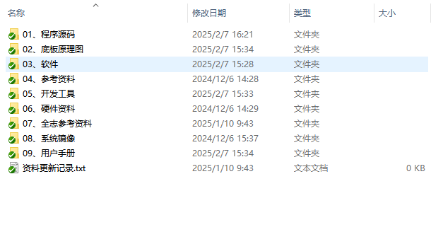
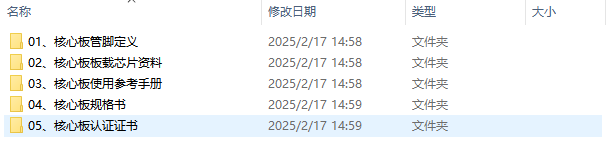

# 5 开发资料

&emsp;&emsp;开发资料下载：

&emsp;&emsp;开发资料基于ATK-CLT113IS开发板编写，请使用开发板进行项目调研和测试。

&emsp;&emsp;开发板资料目录：

 
图 5.1.1 开发板资料目录

&emsp;&emsp;核心板资料下载：

&emsp;&emsp;核心板资料基于ATK-CLAM6AxB核心板编写，从ATK-DLAM6AxB开发板资料中提取出来，方便用户单独下载使用。

&emsp;&emsp;核心板资料目录：

 
图 5.1.2 核心板资料目录

