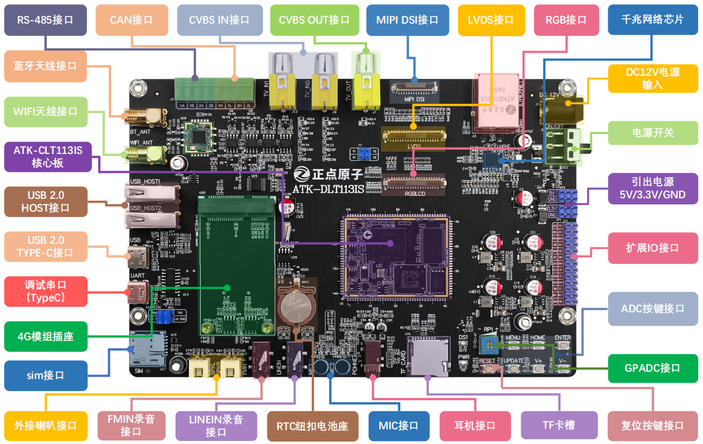
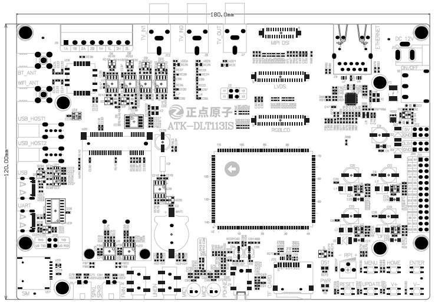

# 1.1 ATK-DLT113IS开发板底板资源

&emsp;&emsp;该开发板采用底板和核心板相结合的设计，采用邮票孔的形式进行连接。核心板占用空间小，具有出色的稳定性。开发板由12V/1A电源适配器进行供电。在现实接口方面，开发板具有三个屏幕接口，分别是RGB、LVDS和MIPI DSI，同时引出三路音频输入接口，两路音频输出接口。此外，还板载了一个千兆网口、两路485已经两路CAN接口，非常适合在工业场景中使用。

&emsp;&emsp;ATK-DLT113IS开发板的底板资源图，如图所示：

 
图 1.1.1 开发板资源图

# 1.2  ATK-DLT113IS开发板尺寸图

&emsp;&emsp;ATK-DLT113IS开发板的底板尺寸图，如下图所示：

 
图 1.2.1 开发板尺寸图

