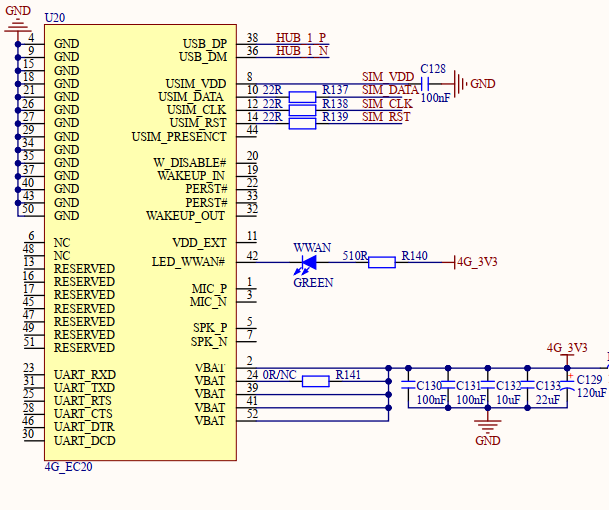

# 3.17 4G模块接口

&emsp;&emsp;开发板板载4G Mini PCIE接口，原理图如下图所示，U20就是Mini PCIE接口的4G模块座子，用于连接Mini PCIE接口的4G模块，比如高新兴的ME3630模块。4G模块虽然采用Mini PCIE接口，但是实际走的USB接口，这里连接到了CH334R扩展出来的一个USB HOST接口上。

 
图 3.17.1 4G模块接口电路

