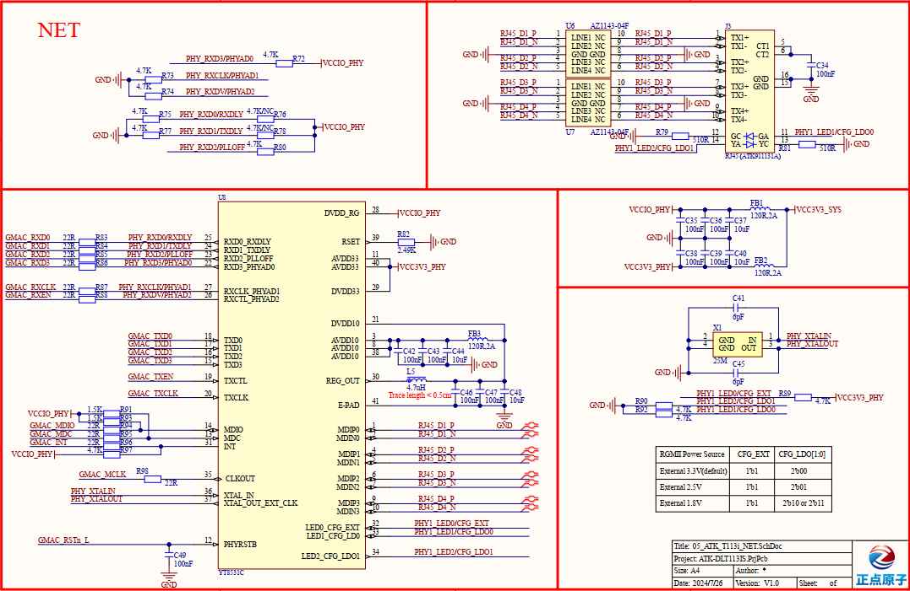

# 3.18  千兆以太网接口

&emsp;&emsp;开发板板载了1个千兆以太网接口(RJ45)，自适应10/100/1000M网速，原理图如图所示：

 
图 3.18.1 千兆以太网接口电路图

&emsp;&emsp;在自行设计底板时需注意： 
&emsp;&emsp;1、RGMII IO电平为3.3V，PHY芯片端需要将接口电平设置为3.3V； 
&emsp;&emsp;2、PCB Layout需要尽量将PHY靠近核心板，并且保证RGMII信号参考平面完整，需要保证PHY芯片外围电源参考平面完整；  
&emsp;&emsp;3、等长要求： RGMII 的接收和发送可分组等长，等长要求≤2.5mm；  
&emsp;&emsp;4、阻抗要求：单端 50ohm；  

&emsp;&emsp;**注：实测速度为710 Mb/s~750Mb/s**

