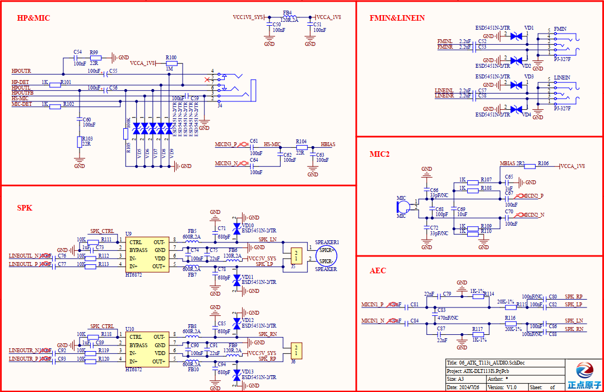

# 3.19  音频接口

&emsp;&emsp;开发板板载两路LINEOUT输出，两路MIC录音，一路LINE IN输入，一路FMIN输入，一路耳机接口，原理图如下图所示。图中HT6872是有一个单声道D类音频功放，LINEOUT输出的音频经过功放芯片放大后，进入扬声器播放。SPK-和SPK+连接了一个板载的8Ω 1W小喇叭。麦克风有两种选择，一个是耳机自带的MIC，一个是板载的咪头。PHONE是一个四段式3.5mm耳机输出接口，可以用来插耳机。

 
图 3.19.1 音频接口电路图

