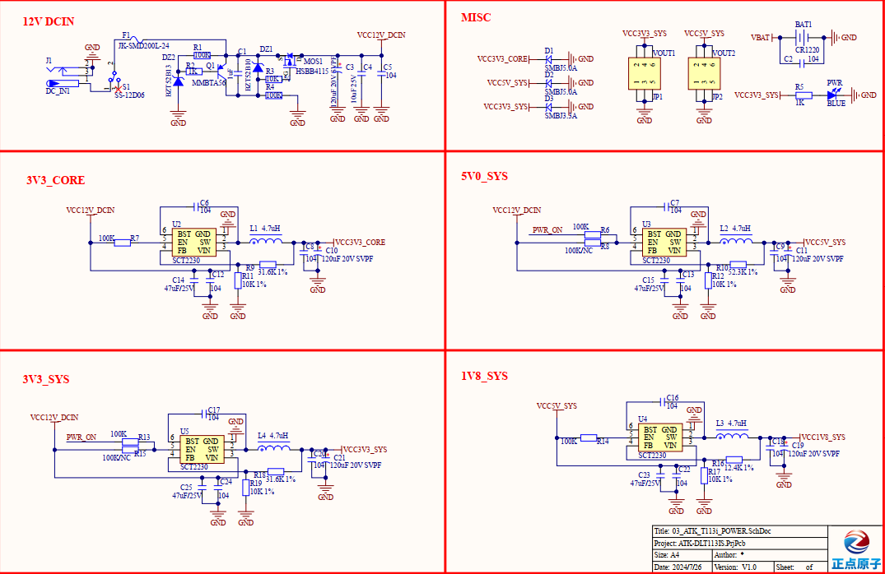

# 3.20  电源部分接口

&emsp;&emsp;开发板的板载电源电路设计如下图所示。开发板采用DC12V/1A的电源适配器作为电源输入，电源从DC_IN端口接入后，经由SCT2230芯片转换，生成VCC3V3_CORE电压，用于为核心板供电。

&emsp;&emsp;当VCC3V3_CORE电压成功输入核心板后，核心板随即启动上电流程，并在上电完成后输出PWR_ON信号。这一信号激活底板上的3V3和5V电源模块，即，U3模块会输出VCC5V_SYS电压，而U5模块则输出VCC3V3_SYS电压。

&emsp;&emsp;随后，VCC5V_SYS电压经过U4模块的进一步转换，生成VCC1V8_SYS电压，为底板提供1.8V的电力供应。值得注意的是，核心板的正常启动需遵循特定的上电时序要求。在底板电源设计方面，可直接参考ATK-DLT113IS开发板的原理图电源部分进行规划。

 
图 3.20.1 电源部分电路图

