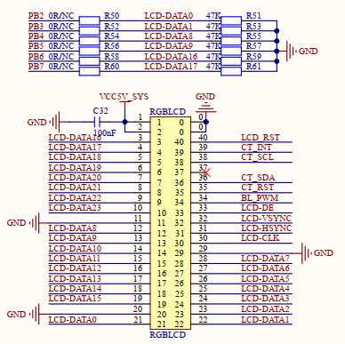

# 3.3 RGB LCD模块接口

&emsp;&emsp;开发板底板载了RGB LCD接口，此部分电路如图所示：

 
图 3.3.1 RGB接口电路图

&emsp;&emsp;图中，RGB LCD接口采用RGB565数据格式，并支持触摸屏（支持电阻屏和电容屏）。该接口仅支持RGB接口的液晶（不支持MCU接口的液晶），目前正点原子的RGB接口LCD模块有：4.3寸（480*272和800*480）、7寸(800*480和1024*600)和10寸(1280*800)等尺寸可选。

&emsp;&emsp;图中的CT_SCL和CT_SDA为I2C2的两根数据线，分别连接到I2C2-SCL 和I2C2-SDA 这两个IO上。BL_PWM是LCD的背光控制IO，连接在PWM3上，用于控制LCD的背光。

